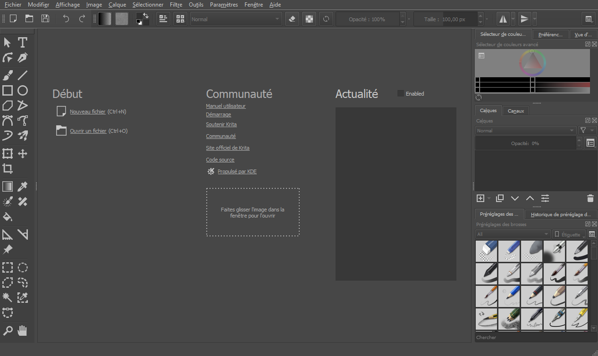
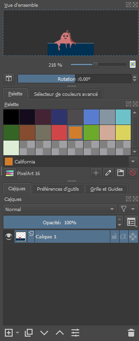
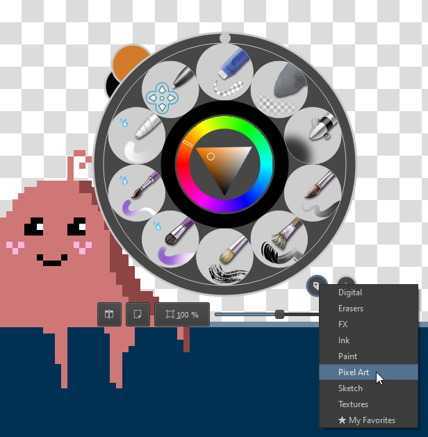
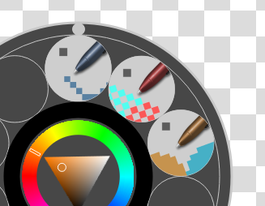

En lançant Krita pour la première fois, voici l'interface que vous devriez avoir sous les yeux :

Vous pouvez dès à présent cliquer sur *Nouveau fichier* (raccourci : `Ctrl+N`) et expérimenter avec les différents outils à gauche, tels que le pinceau (`B`), la pipette (`P`) et la sélection rectangulaire (`Ctrl+R`). Avec le pinceau en main, vous pouvez changer sa couleur, sa taille ou son opacité dans le menu horizontal en haut de la fenêtre.

:::astride
Les documents s'enregistrent au format `.kra`. Pour exporter le résultat final dans un autre format, allez dans *Fichier* > *Exporter*.
:::

### Utiliser les espaces de travail

Les menus à droite de votre écran vous intriguent probablement. Tous ces éléments sont des panneaux, que vous pouvez saisir par leur nom pour les déplacer dans votre espace de travail. Pour en supprimer un, cliquez sur la petite croix et pour en ajouter un nouveau, rendez-vous dans *Paramètres* > *Panneaux*.

Pour dessiner dans les meilleures conditions, il vous faut un espace de travail adapté à ce que vous faites. Le menu *Fenêtre* > *Espace de travail* contient plusieurs espaces parmi lesquels choisir. Comme vous pouvez le constater, il n'en existe pas encore pour le pixel art : nous devons le réaliser nous-mêmes !

En sachant tout cela, vous devriez pouvoir agencer vos panneaux pour imiter mon espace. Un conseil : partez de l'espace de travail "*Big_Paint*" pour vous simplifier la tâche.

- **En haut :** Vue d'ensemble.
- **Au centre :** Palette, Sélecteur de couleurs avancé.
- **En bas :** Calques, Préférences d'outils, Grille et Guides.

:::oofmarvin
Je ne comprends pas grand chose à tous ces outils...
:::

:::winkastride
Pas de panique Marvin, tu verras tout cela un peu plus loin dans le cours.
:::

Une fois votre agencement terminé, rendez-vous dans *Fenêtre* > *Espace de travail* puis cliquez sur *Nouvel espace de travail...* et donnez-lui le nom "*Pixel art*". Vous pouvez désormais passer d'un espace préexistant au vôtre facilement !

### Des pinceaux adaptés

Sélectionnez l'outil de pinceau et dans le menu du haut, jetez un œil aux différents pinceaux (ou brushes) disponibles : il y a un sacré paquet d'options et c'est compliqué de s'y retrouver. Cela dit, si vous faites un clic droit sur votre document avec l'outil en main, une roue s'ouvrira avec une sélection plus claire.

Comme vous pouvez le voir, ces pinceaux ne sont pas adaptés au pixel art, parce que leurs bords sont lissés (c'est l'anti-aliasing) et qu'ils nécessitent une assez grande résolution. Cliquez sur l'étiquette et choisissez la sélection pour pixel art. Vous voilà maintenant avec trois options : un pinceau pixel par pixel classique, un dithering simple et un pinceau rond sans anti-aliasing.

:::remi
Krita dispose d'un moteur de pinceau puissant. Avec un peu de bricolage, vous pourrez créer vos propres pinceaux et outils de dithering !
:::

L'interface est bien rangée, nous sommes désormais fin prêts ! Place à la pratique et à la découverte des différents outils...
