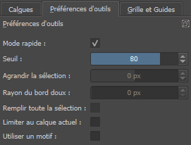
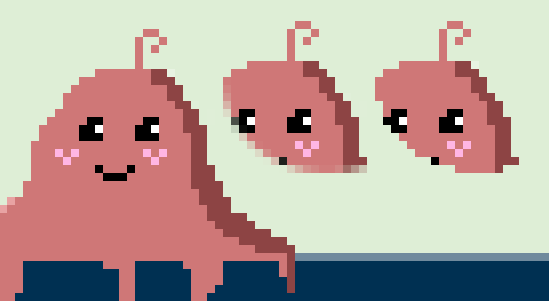
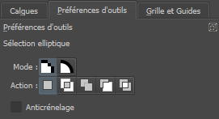
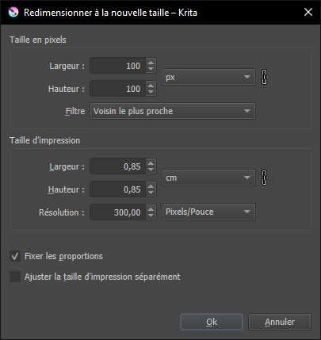

Comme dans la plupart des logiciels de graphisme généralistes, les outils de Krita disponibles à gauche sont pensés pour les images en haute résolution, et manquent de précision pour le pixel art. Heureusement, il est possible de changer ces paramètres pour obtenir une véritable interface pour pixel artiste !

### Outil de remplissage

L'outil Remplir (`F`) propose plusieurs options et par défaut, la couleur de remplissage déborde de la zone choisie en s'effaçant progressivement. En pixel art, on préfère généralement avoir plus de contrôle, donc il vaut mieux cocher le mode rapide dans les préférences de l'outil pour que son comportement soit plus basique.

Il ne vous reste plus qu'à déterminer le seuil de tolérance pour la détection des couleurs similaires alentours.

### Les outils de sélection

Krita propose plusieurs outils pour sélectionner des zones en dessinant une forme ou en détectant les couleurs similaires :

La sélection rectangulaire fonctionne très bien par défaut, cependant les formes de sélection plus originales produisent un anti-aliasing, ou anticrénelage en français.

*Sélection circulaire avec et sans anticrénelage.*

Pour désactiver cet effet, décochez la case "anticrénelage" dans les paramètres de chacun des outils de sélection. Si l'option n'apparaît pas, verifiez que vous êtes bien en mode matriciel (icône de gauche) et non en vectoriel (icône de droite).

### Outil de transformation

L'outil de transformation (`Ctrl+T`) est très pratique pour étirer votre image et la déformer de différentes façons. Vous vous en doutez, cela produit un lissage ! Pour le désactiver, réglez le filtre sur "Voisin le plus proche" (traduction de "*Nearest neighbor*") dans les préférences de l'outil.

### Redimensionner l'image

Avant de publier votre œuvre sur Internet, vous aurez sûrement besoin de l'agrandir pour qu'elle soit lisible. Par défaut, le résultat produit sera flou, mais comme toujours, il est possible de choisir "Voisin le plus proche" pour conserver la netteté de votre pixel art. N'oubliez pas de revenir à la taille d'origine lorsque vous souhaitez retravailler votre dessin !

Je pense qu'on a fait le tour ! Votre environnement devrait maintenant être au point et petit à petit, en vous habituant aux raccourcis clavier de chacun des outils, je suis sûr que vous deviendrez une véritable machine à aligner des pixels ! Pour plus d'information sur la théorie applicable à n'importe quel logiciel, je vous invite à lire notre cours sur le sujet.
