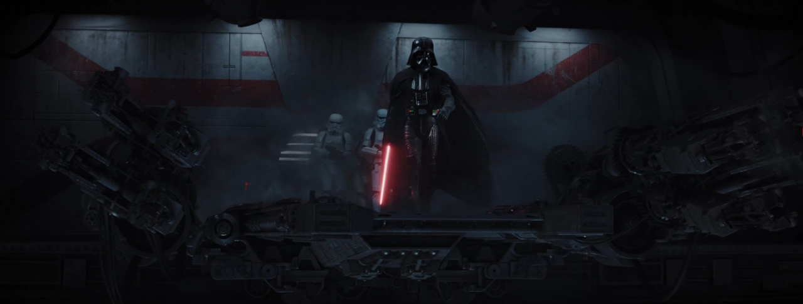

Bienvenue dans ce cours d'initiation à la composition musicale ! Que vous soyez totalement novice ou que vous ayez déjà bidouillé sur un logiciel de musique sans trop savoir quoi composer, cette formation est faite pour vous !

Ici, nous n'allons pas apprendre à utiliser un programme précis, mais plutôt parler des accords, du choix des instruments... Vous pourrez appliquer ces connaissances avec les outils de votre choix !

### Pourquoi apprendre la musique ?

Composer votre propre musique peut avoir des utilités différentes selon le type de jeu. Votre musique peut avoir un rôle d'accompagnement et accentuer l'ambiance déjà donnée par les visuels et le gameplay : c'est ce que l'on entend dans les jeux d'arcade par exemple, où la musique existe avant tout pour motiver le joueur et amplifier le caractère épique des combats. Mais elle peut aussi avoir un rôle plus déterminant et raconter quelque chose par elle-même !

Elle peut créer une tension invisible dans un jeu d'horreur, évoquer des thèmes comme la militarité dans la *Marche impériale* de *Star Wars*, ou encore nous faire ressentir les émotions intérieures du héros par un thème spécifique au personnage.

*L'apparition du thème de Dark Vador suffit à teinter une scène de crainte et de désespoir.*

Tant de possibilités ! De plus, la musique fait aussi vivre le jeu une fois la console éteinte : on garde les mélodies en tête et on réécoute parfois les OST, chargées par les émotions de nos souvenirs de jeu. Beaucoup de thèmes musicaux sont d'ailleurs devenus cultes, comme les thèmes de combat de *Final Fantasy* ou la techno brutale de *Hotline Miami*.

:::marvin
Apprendre la musique, ça fait un peu peur, quand même...
:::

:::astride
C'est compréhensible ! Après tout, à l'école, les étudiants doivent souvent passer beaucoup de temps sur la théorie avant qu'on puisse leur donner plus de liberté créative.
:::

Si vous pensez qu'apprendre la musique est intimidant, je vous comprends totalement ! Après tout, à l'école, les étudiants doivent souvent passer beaucoup de temps sur la théorie avant qu'on puisse leur donner plus de liberté créative. Pour que cette formation soit accessible au plus grand nombre, et que vous n'attendiez pas des années avant de composer, nous allons voir la théorie d'une façon plus condensée et détendue, avec des exemples en musique.

### Ce que l'on va apprendre

Nous commencerons par des bases de solfège pour inventer des mélodies qui sonnent bien. Nous verrons aussi comment créer des accords harmonieux facilement.

Lorsque vous connaîtrez tous les concepts utiles pour composer vos premières musiques, nous passerons au choix des instruments. Quelles sont les combinaisons efficaces ? Quel orchestre choisir pour une musique mystérieuse, mélancolique, ou épique ?

Enfin, vous apprendrez à construire un morceau, pour le faire évoluer pendant plusieurs minutes tout en évitant les pièges communs des débutants. Nous verrons même comment créer des leitmotivs (des thèmes répétés à travers toutes vos musiques) comme le font les grandes séries de films !

Bien sûr, cette formation n'est pas aussi complète que des études spécialisées, mais elle vous permettra de faire le premier pas, et de vous amuser tout en produisant un résultat dont vous êtes fier. Après avoir lu ces trois chapitres, vous devriez être assez à l'aise pour en apprendre plus à votre rythme si vous le souhaitez, et nous vous donnerons quelques ressources pour aller plus loin.
