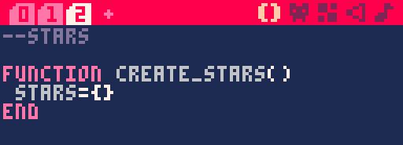
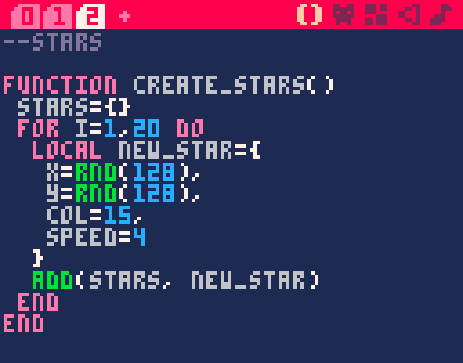
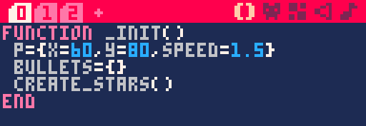
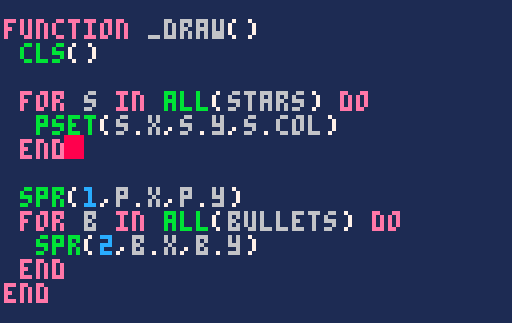
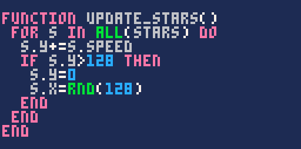

Continuons de nous entraîner avec les boucles for en affichant des étoiles qui défilent.

Vidéo

Chaque étoile aura une position X et Y, une couleur et une vitesse. Comme vous le voyez, en faisant varier la couleur et la vitesse des étoiles, on peut créer un effet de profondeur sympathique !

Dans un nouvel onglet nommé stars, créez une fonction `create_stars()`. Définissez un tableau `stars` qu'on va remplir juste après de toutes nos étoiles.



Disons que je veux créer 20 étoiles toutes à des endroits aléatoires de l'écran. Je pourrais copier 20 fois le code de création de l'étoile... ou utiliser un boucle for !



Pour rappel, `i` est une variable locale qui commence à 1, et monte de 1 à chaque fois que la boucle se joue, jusqu'à 20. En fait, si on voulait, `i` pourrait même monter de 5 en 5. Il faudrait écrire `i=1,20,5`, mais ça n'aurait pas d'intérêt ici.

A 20 reprises, on crée une étoile avec un X et Y aléatoire dans l'écran (qui fait 128px de côté), on lui donne une couleur et une vitesse, puis on l'ajoute au tableau `stars`.

> Dans PICO-8, `rnd(n)` renvoie un nombre décimal où 0 ≤ résultat < n. Si besoin, vous pouvez obtenir un nombre entier en arrondissant au nombre inférieur `flr()` ou au nombre supérieur `ceil()`.

Ok, voilà pour la création de nos étoiles au début du jeu. Vous pouvez appeler cette fonction dans init.



Même s'il n'y a pas encore de mouvement, j'ai bien envie de voir à quoi mes étoiles ressemblent ! Nous n'allons pas dessiner de sprite pour afficher un point, puisqu'il existe pour cela la fonction "pixel set" : `pset(x, y, couleur)`.



Comme je vous l'avais dit, PICO-8 dessine chaque nouvel élément par-dessus ce qui existe déjà. Il faut donc dessiner les étoiles en premier, pour que le vaisseau soit affiché par-dessus.

Vous pouvez déjà ajuster la couleur et le nombres d'étoiles... Mais vous verrez, ça aura beaucoup plus de cachet en mouvement.

Créons une fonction `update_stars()` pour faire défiler les étoiles au cours du jeu. Pour chaque étoile dans le tableau `stars`, on va diminuer son Y... Eh oui, c'est l'heure d'écrire une nouvelle boucle for :


Si vous essayez, vous allez vous apercevoir d'un petit problème... Quand une étoile atteint le bas de l'écran, nous allons la replacer en haut, et lui redonner un X aléatoire (sinon, le même motif défilerait en boucle).



On commence à être pas mal ! Voici quelques idées si vous voulez changer le style des étoiles à votre façon :

- Vous pouvez rendre leur vitesse aléatoire avec `speed = rnd(4)`. Par contre, certaines étoiles auront une vitesse très proche de 0. Pour obtenir une vitesse entre 2 et 4, écrivez `2 + rnd(2)`.

- Vous pouvez également rendre la couleur aléatoire ! Si vous donnez un tableau à `rnd()`, elle vous renverra un élément aléatoire du tableau. Préparez une liste de couleurs, par exemple `{9, 14, 15}`, et vous pouvez écrire `col = rnd({9, 14, 15})`.

- Une astuce que j'aime bien, c'est de créer un groupe d'étoiles lentes à l'arrière plan, et un groupe d'étoiles rapides au premier plan. Vous pouvez le faire ainsi :

```lua
for i=1,20 do
    local new_star = {
        x = rnd(128), y = rnd(128),
        col = 1,
        speed = 1 + rnd(0.5)
    }
    add(stars, new_star)
end
for i=1,8 do
    local new_star = {
        x = rnd(128), y = rnd(128),
        col = 6,
        speed = 3 + rnd(1)
    }
    add(stars, new_star)
end
```
