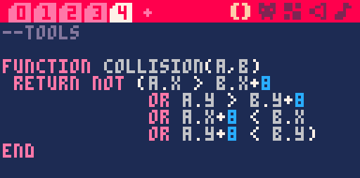
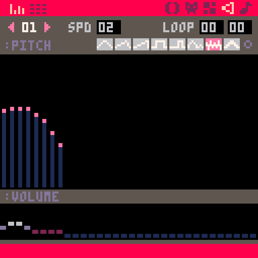
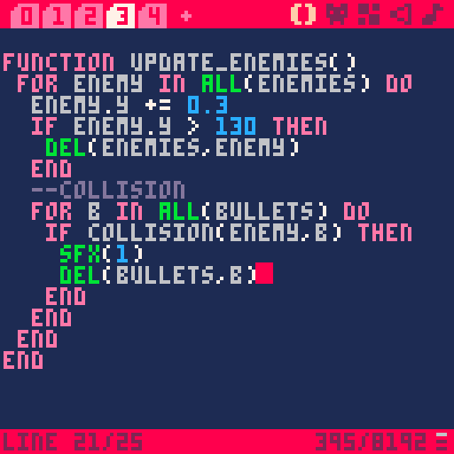
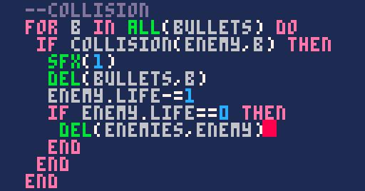

Pour détruire l'ennemi, il faudrait que l'on puisse détecter lorsque notre tir entre en contact avec lui. La grande question étant : comment programme-t-on un système de collisions ?

Le tir et l'ennemi auront chacun une boîte de collision, c'est-à-dire un carré imaginaire qui indique où est-ce qu'on peut les toucher. Ici, pour simplifier, toutes les boîtes de collisions feront 8 × 8 pixels, la taille d'un sprite. Lorsque ces carrés invisibles sont l'un par-dessus l'autre, alors il y a collision.

Vous pourriez détecter la collision de plusieurs façons, mais je vais vous présenter la méthode la plus simple que j'ai trouvée, qui ne vient pas de moi mais du sympathique [MBoffin](https://mboffin.itch.io/pico8-overlap). Il s'est aperçu que le plus facile est en fait de vérifier que les boîtes ne se touchent *pas*.

Voici une démo interactive pour bien comprendre ce qu'on va faire. Vous pouvez déplacer l'ennemi avec les flèches et le projectile avec les touches ESDF.

<iframe width="538" height="539"
  src="/jeux-pico-8/demo-collisions/index.html">
</iframe>

La fonction de collision fait 4 vérifications ; si au moins une est vraie, c'est que les boîtes ne se touchent pas. Par contre, si aucune n'est vraie, on sait qu'il y a collision !

### Petite leçon sur les fonctions

Jusqu'ici, nous avons créé des fonctions simplement pour rassembler du code et le ranger proprement ailleurs. En vérité, on peut faire beaucoup plus de choses avec ! Notre objectif est d'écrire une fonction de collision qui nous servira d'outil à travers tout notre jeu : on pourra renseigner deux objets, en écrivant par exemple `collision(projectile, ennemi)`, et elle nous dira s'ils se touchent ou pas. Plutôt cool, non ? Mais pour ça, je dois vous expliquer quelques principes.

#### Les arguments

Une fonction peut prendre des arguments. Par exemple, lorsque vous écrivez `rnd(3)` pour obtenir un nombre aléatoire, le `3` est un argument. Mais comment dire à votre fonction de prendre des arguments ? Il suffit de leur donner un petit nom lorsque vous la créez :

```lua
function addition(x, y)
  return x + y
end
```

Les arguments fonctionnent comme des variables locales au sein de votre fonction, donc vous pouvez les nommer comme vous voulez : cela n'impactera pas le reste du jeu. `return` est la valeur que renverra votre fonction lorsque vous l'utilisez.

```lua
un_nombre = 2
un_autre = 15
resultat = addition(un_nombre, un_autre)
```

Dans cet exemple, la variable `resultat` vaut 17 !

#### Retourner vrai ou faux

La valeur retournée par une fonction peut être un texte, un tableau... ou bien un booléen :

```lua
function is_one(x)
  if x == 1 then
    return true
  else
    return false
  end
end
```

Cette fonction vérifie que la valeur passée en argument soit égale à 1, mais on pourrait l'écrire plus simplement. Comme `x == 1` est une vérification, l'opération renvoie déjà `true` ou `false` par elle-même. Ce qui veut dire que...

```lua
function is_one(x)
  return x == 1
end
```

Eh oui, cela renverra bien `true` ou `false` ! Vous pourriez l'utiliser dans une condition comme ceci :

```lua
nombre = 1
if is_one(nombre) then
  print("bravo !")
end
```

Ok, je pense que vous avez compris. Passons au vif du sujet !

### Programmer la collision

Prenez le temps de bien comprendre la logique de la démo. Notre fonction de collision doit effectuer les 4 vérifications, et si au moins une est vraie, elle doit retourner faux (pas de collision).

Pour vérifier plusieurs choses en une seule condition, on utilise les opérateurs `and` et `or`.

```lua
if x == 1 and y == 1 then
  -- x et y valent 1
end
if x == 1 or y == 1 then
  -- soit x vaut 1, soit y vaut 1, soit les deux !
end
```

Nous utiliserons `or` car cela nous suffit si une seule des vérifications est vraie.

La fonction de collision prendra deux arguments, ***a*** et ***b***, qui doivent chacun posséder des positions X et Y. C'est le cas des ennemis et des projectiles. Plus qu'à faire une petite tambouille, et *tadaam* :

```lua
function collision(a, b)
  if a.x > b.x + 8
  or a.y > b.y + 8
  or a.x + 8 < b.x
  or a.y + 8 < b.y then
    return false
  else
    return true
  end
end
```

J'ai écrit la longue condition sur plusieurs lignes pour une meilleure lisibilité. Les `return` à la fin sont un peu répétitifs ; ça vous rappelle peut-être l'exemple de tout à l'heure... Cependant, nous aurons besoin d'une astuce pour condenser l'écriture cette fois-ci :

```lua
function collision(a, b)
  return not (a.x > b.x + 8
              or a.y > b.y + 8
              or a.x + 8 < b.x
              or a.y + 8 < b.y)
end
```

L'opérateur `not` inverse la valeur qui suit. Ainsi, si la condition entre parenthèses est vraie, on retourne `false`, mais si elle est fausse, on retourne `true`. Ouais, c'est technique !

Bien sûr, ce n'est pas toujours une bonne idée de minimiser le code à outrance. Si la première écriture est plus lisible pour vous, gardez-la ! Il est très important d'écrire du code facile à lire : le vous du futur vous remerciera pour ça. Ecrivez cette fonction dans un nouvel onglet où vous pourrez ranger les outils en tout genre.



### Utiliser la fonction



Retrouvez la fonction `update_enemies()` pour y ajouter la vérification de collision. Pour chaque balle existante dans `bullets`, on vérifie si elle touche l'ennemi actuellement examiné. Si oui, on joue le son et on supprime la balle (pour ne pas qu'elle lui passe à travers).



Essayez, ça fonctionne ! Après tous ces efforts, ça fait du bien, pas vrai ?

Souvenez-vous : en créant l'ennemi dans `spawn_enemies()`, on lui avait donné des points de vie. Essayez de lui retirer sa vie et de le supprimer lorsqu'il n'en a plus.



Comme un nouvel ennemi apparaît immédiatement après, c'est un peu étrange. Vous pouvez éloigner la position Y de départ des ennemis à −24 par exemple.

On a bien avancé, mais il a fallu se triturer les méningesVous savez, cet alien a eu ce qu'il méritait mais on devrait le faire exploser dans les règles de l'art.
