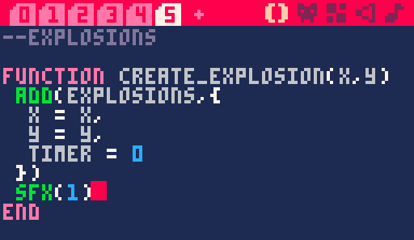
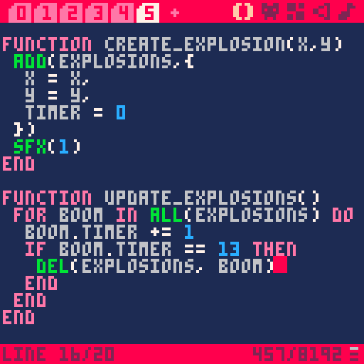
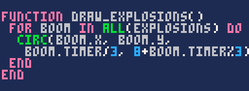
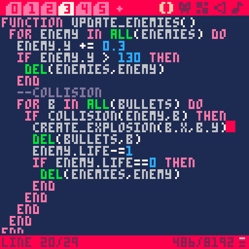

Il existe une fonction pour dessiner un cercle dans PICO-8, qui prend les arguments suivants :

```lua
circ(x, y, rayon, couleur)
```

Vous pourriez aussi écrire `circfill` pour que l'intérieur du cercle soit rempli de la couleur choisie. En faisant varier rapidement le rayon et la couleur au fil du temps, on obtient un petit effet d'explosion simple à faire ! Voyez par vous-même :

<iframe width="538" height="539"
  src="/jeux-pico-8/demo-explosions/index.html">
</iframe>

Prenez le temps d'examiner les détails de la démo. Notre explosion aura un timer qui avancera à chaque frame et permettra de savoir à quel stade est notre animation. Lorsque le timer dépasse 12, c'est la fin de l'animation et on supprime l'explosion.

Comme vous pouvez le voir, le rayon augmente simplement au fil du temps avec le calcul ***timer* ÷ 3**. Vous pourriez changer ce chiffre pour obtenir une explosion plus ou moins grande.

Pour faire varier la couleur, c'est un peu plus original : on souhaite obtenir la séquence 8, 9, 10, 8, 9, 10... donc on commence à 8 et on y ajoute un **modulo**.

Le modulo, c'est le reste d'une division euclidienne. Vous vous souvenez peut-être de cette division avec des nombres entiers que l'on pose à l'école primaire. Par exemple, 17 divisé par 3, ça fait 5 et il reste 2. Donc **17 modulo 3 = 2**.

Si l'on divise n'importe quel nombre par 3, le reste pourra être 0, 1, 2, mais jamais 3 ou plus. On peut donc utiliser le modulo pour obtenir une suite de nombres : si l'on fait ***timer* modulo 3** et qu'on augmente ***timer*** au fil du temps, le résultat sera 0, 1, 2, 0, 1, 2... Avec modulo 5, ce serait 0, 1, 2, 3, 4, 0, 1, 2, 3, 4... C'est très pratique pour coder une séquence d'animation en un clin d'œil !

Dans la démo, le modulo est noté `%`. C'est comme ça qu'on l'écrit en Lua et dans la programmation en général ! Si c'est la première fois que vous voyez ce concept, ne vous inquiétez pas : nous y reviendrons plus tard dans cette étape et vous pourrez expérimenter par vous-même.

### Création du système

Nous aurons parfois plusieurs explosions affichées à la fois ; le mieux est donc de toutes les stocker dans un tableau, que vous pouvez créer dans `_init()`.


Maintenant, on va travailler dans un nouvel onglet "*Explosions*". Essayons d'écrire le système le plus pratique possible à utiliser ! Quand on voudra créer une explosion au cours du jeu, il nous suffira d'appeler `create_explosion()` en donnant l'emplacement de l'explosion. La fonction prendra donc deux arguments : X et Y.


*Pour un meilleur effet, chaque explosion devrait jouer un son !*

Si on récapitule, une explosion est structurée ainsi : `{x, y, timer}`. A chaque frame, nous devrons faire avancer le timer des explosions existantes, et les supprimer quand elles dépassent 12. Ce sera le job de notre fonction d'update !



Plus qu'à afficher les explosions d'après ce que je vous expliquais au début. Pour rappel, le rayon du cercle vaut ***timer* ÷ 3** et la couleur est **8 + *timer* modulo 3**.



Bien ! Pensez à appeler `update_explosions()` dans update et `draw_explosions()` à la fin de draw. Quant à la création de l'explosion... elle devrait arriver lorsque l'ennemi se fait toucher, et on vérifiait cela dans `update_enemies()`. Enlevez le son que l'on jouait, puisque désormais votre fonction joue le son, puis créez une explosion au point d'impact, c'est à dire à la position de la balle.



Ça fonctionne bien ! Il faudrait juste décaler un peu l'explosion. Souvenez-vous que la position d'un cercle indique son centre, donc avec `b.x + 4` et `b.y + 4`, vous seriez au centre de votre sprite de balle. A vous de doser ça comme bon vous semble.
