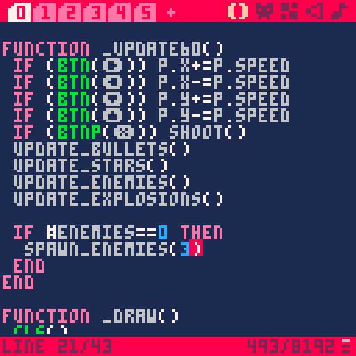
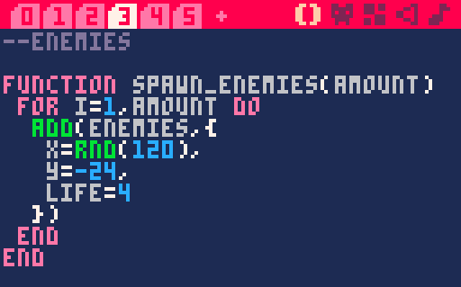
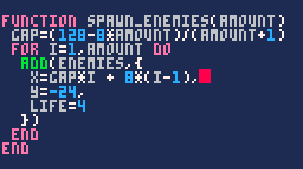

Pour le moment, on a un bête ennemi qui apparaît tout seul en haut de l'écran. Vous pourriez lui donner un X aléatoire pour ajouter de la variété, mais cela reste très simple. Dans cette étape, on va améliorer la fonction de spawn pour pouvoir faire apparaître le nombre d'ennemis que l'on veut en même temps, en écrivant par exemple `spawn_enemies(3)`.

Pour commencer, si vous l'avez gardé, retirez le `spawn_enemies()` que l'on appelait dans `_init()`, car il ne servait qu'à faire des premiers tests. Dans update, ajoutez le chiffre de votre choix en argument de la fonction :



Pour l'instant, cela ne change rien en jeu : nous devons dire à la fonction quoi faire de ce chiffre. Donnez-lui une appellation (j'ai choisi `amount`) et pour répéter la commande `add()` autant de fois qu'il y a d'ennemis, englobez-la dans une boucle for qui va de 1 à `amount`.


*Pour un rappel sur les boucles for, retournez à l'étape des projectiles ou des étoiles.*

Vous pouvez essayer avec une position X aléatoire pour bien différencer les ennemis. Le souci avec cette méthode, c'est que le résultat est assez chaotique et la plupart des jeux ont besoin de motifs plus réguliers. Je vous propose donc d'écrire un petit calcul pour obtenir le même écart entre chaque ennemi ! Voici un exemple en images, avec la position de nos futurs ennemis en rouge :

[[Video src="/videos/pico-8/ecart-vagues.mp4" autoplay muted loop controls]]

A partir d'un nombre d'ennemis donné, le calcul devra nous dire la largeur de l'écart (en beige) entre chaque ennemi. En connaissant l'écart, on pourra faire apparaître nos ennemis au bon endroit très facilement. Voici ma méthode :

**Longueur d'un écart = Espace total utilisable par les écarts** (la largeur de l'écran − la largeur totale de tous les ennemis) **÷ nombre d'écarts** (1 de plus que le nombre d'ennemis)

Cela fait **(128 − 8 × *n*) ÷ (*n* + 1)** où ***n*** est le nombre d'ennemis.

Créez une variable stockant l'écart au début de la fonction :


La variable `gap` aura désormais le même résultat que dans l'animation d'exemple. Pour faire apparaître vos ennemis, vous pourriez être tentés de simplement leur donner cette position :

```lua
x = gap * i
```

Essayez, et vous verrez que les ennemis se tassent légèrement sur la gauche. Afin que la vague soit bien centrée, il ne suffit pas de compter `gap` ! Pour chaque ennemi après le premier, il faut aussi prendre en compte la largeur des ennemis précédents, de 8 pixels chacun. Donc le calcul exact sera plutôt :

```lua
x = gap * i + 8 * (i - 1)
```

:::oofmarvin
J'ai du mal avec les maths... Je ne comprends pas pourquoi on écrit **(*i* − 1)**...
:::

:::tssastride
Essaye de faire le calcul en faisant varier ***i*** ! Pour le premier ennemi de la vague, ***i* = 1**, donc X vaudra seulement ***gap* × 1**. Pour le deuxième ennemi, X vaut ***gap* × 2 + 8** et ainsi de suite... 
:::

Et voilà, votre vague est toute belle, sans bavure ! Rendons maintenant le nombre d'ennemis aléatoire quand on appelle le spawn dans `_update60()`.



Pour rappel, le [manuel de PICO-8](https://www.lexaloffle.com/pico-8.php?page=manual#main_div:~:text=rnd%20x) explique que `rnd(n)` retourne un nombre décimal où 0 ≤ résultat < n. On doit arrondir le résultat en un nombre entier, et pour cela deux méthodes s'offrent à vous :

- `flr(rnd(n))` donne un nombre entier entre 0 et ***n* − 1**.
- `ceil(rnd(n))` donne un nombre entier entre 1 et ***n***.

A vous de choisir ! Je souhaite obtenir un nombre aléatoire entre 1 et 7, donc je vais écrire `ceil(rnd(7))`.

:::remi
Pour retenir ces fonctions, sachez que `flr` veut dire *floor*, qu'on peut traduire par sol ou plancher, donc vers le bas, et `ceil` veut dire *ceiling* ou plafond, vers le haut.
:::


Le jeu commence à prendre forme ! Dans la prochaine étape, nous allons rendre les ennemis plus menaçants en leur permettant de tirer. Ce sera la dernière chose à faire avant d'ajouter un score et un écran de fin !
