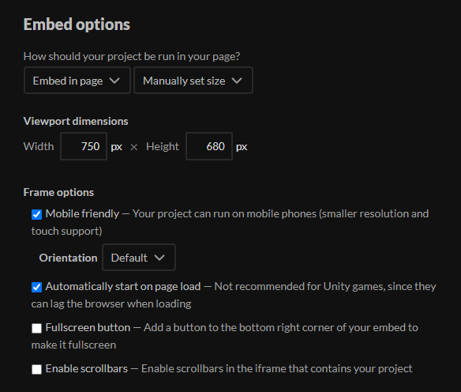
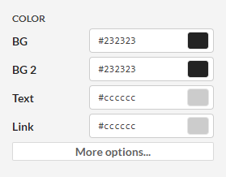

Les jeux PICO-8 sont généralement assez courts et on aime les lancer rapidement, comme des jeux d'arcade. C'est pourquoi à mon avis, ils ont toute leur place sur navigateur. Créer une version web de votre jeu est simple comme bonjour :

```
export -f mon-jeu.html
```

Le paramètre `-f` n'est pas obligatoire, mais je vous le conseille : il indique que les fichiers seront générés dans un sous-dossier pour s'y retrouver plus facilement.

Le fichier HTML s'ouvre avec le navigateur et contient le lecteur de PICO-8. Essayez-le ! Le fichier JS, quant à lui, contient toutes les données de votre jeu. Si à l'avenir vous éditez le fichier HTML, pour ajouter du texte en-dessous ou pour changer les couleurs par exemple, vous pourrez mettre à jour le jeu en générant uniquement un fichier JS :

```
export mon-jeu.js
```

### Héberger le jeu sur Internet

Pour rendre votre jeu accessible à une certaine adresse, plusieurs options s'offrent à vous : si vous possédez un serveur, vous pouvez simplement y envoyer les deux fichiers. Sinon, vous pouvez envoyer votre cartouche sur le site de Lexaloffle, la communauté officielle de PICO-8. C'est là que les développeurs et développeuses s'échangent des démos techniques et des tutoriels ; j'y trouve d'ailleurs la plupart de mes astuces. On peut aussi y publier des vrais jeux, mais pour cela j'ai une préférence pour itch.io, qui est davantage visité par un public de joueurs et qui a de meilleures fonctions de recherche.

### Paramétrer sur itch.io

Créez un nouveau projet sur itch.io. Si vous avez besoin de conseils supplémentaires, n'hésitez pas à consulter notre cours sur itch.io, car je vais uniquement me concentrer sur les détails propres à PICO-8.

Compressez le dossier du jeu web (sur Windows : clic droit, envoyer vers dossier compressé). Uploadez le zip sur itch.io et cochez "This file will be played in the browser". Cela permettra à votre fichier HTML de s'afficher dans un *embed*, c'est-à-dire un cadre au sein de la page itch.io. Plus bas, vous pouvez régler les options de ce cadre, et pour un jeu PICO-8, je vous conseille ces réglages :



Une fois sur la page du jeu, cliquez sur Edit theme pour choisir des couleurs qui accompagnent bien l'embed.



Sachez qu'en plus de la version web, vous pouvez aussi proposer des versions Windows, Mac et Linux qui seront disponibles au téléchargement en bas de la page.

### Jouer sur smartphone

Un grand avantage de la version web des jeux PICO-8, c'est l'interface pour mobile qui se déclenche automatiquement si vous êtes sur ce type d'appareil ! Cela dit, sur les téléphones de mon entourage, cela n'est pas idéal : le jeu est généralement fluide mais le son fait des crissements très désagréables. A surveiller, cela évoluera peut-être un jour !