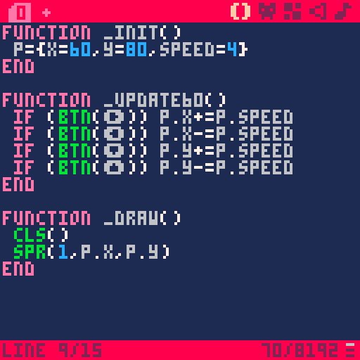
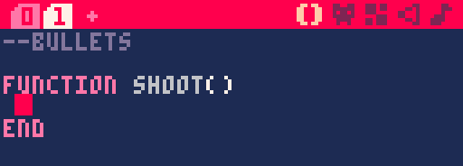
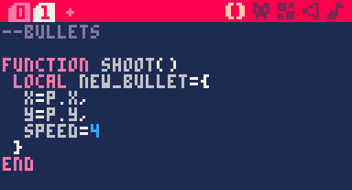
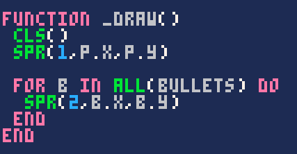
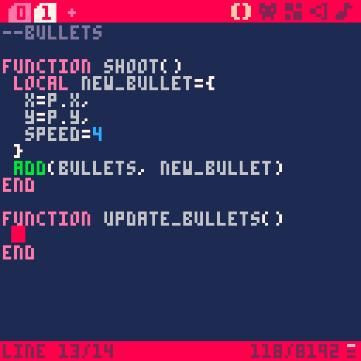
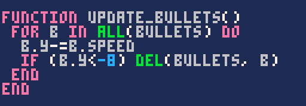
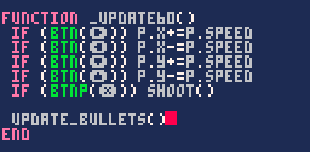
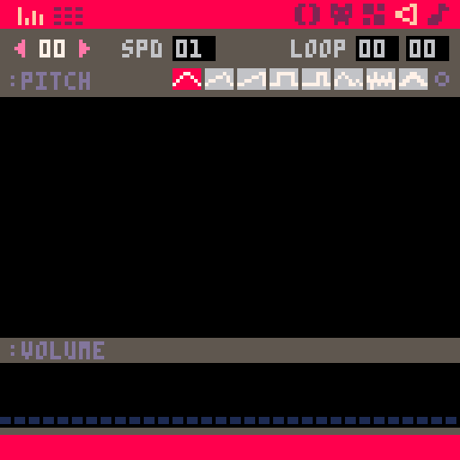
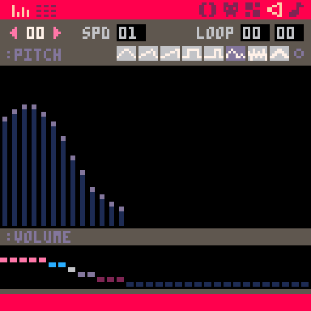
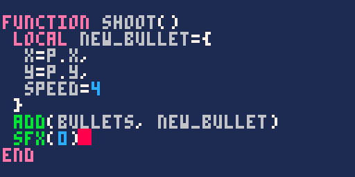

Bienvenue dans ce chapitre sur la réalisation d'un shoot'em up dans l'espace ! Vous pouvez commencer par le shooter ou par le jeu d'aventure dans l'ordre que vous voulez. Ceci dit, j'expliquerai certaines choses plus en détail ici, donc si vous ne vous sentez pas encore à l'aise, je vous conseille de commencer par ce chapitre.

Précédemment, nous avons vu comment déplacer un personnage, mais si vous venez d'arriver, je vous laisse recopier ce code tout simple qui nous servira de base.



Un tir aura trois propriétés : une position X, une position Y, et une vitesse. Pour l'instant, on n'a pas encore d'ennemi. On va donc commencer par faire avancer les projectiles à chaque frame, puis les supprimer quand ils atteignent le bord de l'écran, afin de ne pas nous retrouver avec une quantité gigantesque de projectiles au bout de quelques minutes.

Mais d'abord, dessinons notre petit projectile !


Nous allons créer un tableau `bullets` qui contiendra tous nos projectiles. Déclarez le tableau dans `_init()` et laissez-le vide : on le remplira plus tard.


### La fonction de tir

Je vous propose de créer un nouvel onglet pour y voir plus clair, dans lequel on mettra tout ce qui concerne les balles. Si vous écrivez un commentaire à la première ligne de l'onglet, cela affichera un petit nom lorsque vous passerez la souris dessus.



Créez une fonction `shoot()` que l'on appellera dès que le vaisseau doit tirer. Cette fonction va créer une nouvelle balle à l'endroit où se situe le joueur. Définissons la balle dans un tableau :



Vous voyez que comme pour le vaisseau, on définit une vitesse que l'on utilisera plus tard. `local` signifie que cette variable est locale : lorsque nous quitterons la fonction, elle sera détruite. C'est une bonne pratique de créer une variable locale si vous n'en avez pas besoin en dehors du bloc où vous la créez.

Nous avions préparé un tableau `bullets` pour contenir toutes nos balles. Dans PICO-8, une commande permet d'ajouter un nouvel élément à la suite d'un tableau :

```lua
add(tableau, nouvel_element)
```

Dans notre cas, on ajoute le contenu de la variable locale `new_bullet` dans un nouvel emplacement de notre tableau `bullets`.


Si vous avez du mal à visualiser ce que cela veut dire, imaginez qu'en jeu, si l'on tire trois fois, le tableau `bullets` contiendra quelque chose comme :

```lua
bullets = {
    {x = 20, y = 30, speed = 4},
    {x = 26, y = 43, speed = 4},
    {x = 22, y = 61, speed = 4}
}
```

Toutes les balles existantes dans le jeu sont dans le tableau. C'est pratique car pour manipuler toutes les balles d'un coup, il suffira d'accéder à ce tableau.

On va appeler la fonction `shoot()` lorsque le joueur appuie sur X. Retournez à la fonction d'update, dans le premier onglet (naviguez avec Ctrl+Tab et Ctrl+Shift+Tab).


*Maj+X affiche le symbole X.*

Tout simplement ! Vous savez maintenant écrire une fonction et l'appeler ailleurs, ce qui est très pratique pour découper son code d'une façon plus lisible.

Notez que l'on utilise `btnp()` au lieu de `btn()`. C'est le diminutif de "button pressed" : au lieu d'être tout le temps vraie tant que le bouton est appuyé, cette fonction renvoie `true` par intervalles quand le bouton est maintenu. On l'utilise généralement pour se déplacer dans un menu, mais dans notre cas, ça permet d'obtenir très simplement un tir qui fonctionne. Vous pouvez modifier la durée de l'intervalle en consultant l'explication de "btnp" dans le [manuel](https://www.lexaloffle.com/pico-8.php?page=manual#main_div:~:text=btnp%20%5Bi%20%5Bp%5D%5D).

### Afficher les tirs

Si vous testez le jeu maintenant, il ne devrait rien se passer de spécial. C'est parce que nous devons afficher le sprite de tir dans la fonction `_draw()`.

Afficher le sprite du vaisseau était tout simple, parce qu'il n'y en a qu'un. Mais cette fois, nous devons afficher autant de sprites qu'il y a de balles dans le tableau `bullets` ! Il peut très bien y en avoir deux, vingt, ou zéro... Nous devons donc automatiser ça.

#### Petite leçon sur les boucles for

Une boucle for permet de répéter une instruction un nombre de fois donné.

```lua
for i=1,10 do -- Pour i allant de 1 à 10, répéter :
    spr(1, i*10, 60)
end
```

`i` est une variable locale qui vaudra 1, 2... jusqu'à 10 à l'intérieur de la boucle. Donc ce code affichera 10 fois le sprite 1, d'abord à la position 10 en X, puis 20... jusqu'à 100. Vous pouvez nommer `i` comme vous voulez : c'est votre compteur.

Une boucle for peut également parcourir un tableau. Cela veut dire qu'elle se jouera une fois par élément du tableau. Chaque élément de `bullets` étant une balle, la boucle va se jouer une fois par balle !

```lua
for b in all(bullets) do -- Pour b parcourant le tableau bullets, répéter :
    spr(2, b.x, b.y)
end
```

Etant donné que votre tableau `bullets` ressemble à ceci en cours de jeu, avec plus ou moins de balles :

```lua
bullets = {
    {x = 20, y = 30, speed = 4},
    {x = 26, y = 43, speed = 4},
    {x = 22, y = 61, speed = 4}
}
```

La variable `b` qui parcourt le tableau vaut quelque chose comme ceci à chaque passage dans la boucle :

```lua
b = {x = 20, y = 30, speed = 4}
```

C'est pour cela qu'on peut manipuler chaque balle en écrivant `b.x`, `b.y`... Puis lorsque la boucle a été répétée avec chaque élément de `bullets`, c'est fini et on sort de la boucle.



N'oubliez pas que `b` est simplement le nom de la variable locale qui parcourt le tableau. Elle peut être nommée comme vous le souhaitez.

Testez le jeu, et... les balles s'affichent, mais restent immobiles à l'endroit où elles ont été tirées. Nous avons fait le plus gros du travail ! Il faut maintenant les faire avancer.

### Déplacer les projectiles

Comme déplacer les balles n'est pas une question d'affichage, mais plutôt de gestion du jeu, ça a sa place dans update. Encore une fois, pour rester bien organisés, nous allons créer une fonction `update_bullets()` dans l'onglet des bullets.



En français, la fonction doit faire ceci : « Pour chaque élément dans `bullets`, le déplacer vers le haut. » On utilise donc une boucle for !


Notez qu'on diminue Y pour aller vers le haut de l'écran. Dans mon cas, ma vitesse est de 4, donc c'est comme si j'avais écrit `b.y -= 4`. N'oublions pas de supprimer les balles qui sortent de l'écran, sinon la console va ramer au bout de quelques minutes. Comme le haut de l'écran est `y = 0` et qu'un sprite fait 8 pixels de haut, on ne voit plus la balle si sa position Y est inférieure à -8.



`del()` fonctionne comme `add()`, mais pour enlever un élément d'un tableau.

Nous allons exécuter cette fonction à chaque frame, dans update.



Testez le jeu. Tadaam ! Pas mal, non ?

### L'effet sonore

Un tir de vaisseau spatial sans son "piou piou", ce n'est pas un vrai tir ! Dans PICO-8, il est très facile de créer des sons et des musiques, même si vous n'y connaissez rien. Cliquez sur l'avant-dernière icône pour ouvrir l'éditeur de son.



Dessinez dans le cadre noir et appuyez sur Espace pour jouer le son. Vous allez voir, c'est magique !

N'hésitez pas à essayer les 8 instruments différents. Pour changer l'instrument des notes déjà dessinées, faites Shift+Clic sur l'instrument.

En haut à gauche, c'est le numéro du son que vous éditez. A côté, vous pouvez changer la vitesse du son avec le clic gauche et le clic droit. Pour un effet sonore, la vitesse doit être très rapide, tandis que pour une mélodie, elle doit être plus lente.

En bas de l'écran, vous pouvez modifier le volume. Baisser le volume à zéro supprime la note. Pour un bon son de tir, vous pouvez essayer d'avoir un volume assez fort au début, puis qui diminue au fil du temps.



Dans la fonction `shoot()`, jouez le son numéro 0 avec `sfx(0)`.



Essayez-le jeu et écoutez : ça change tout !
