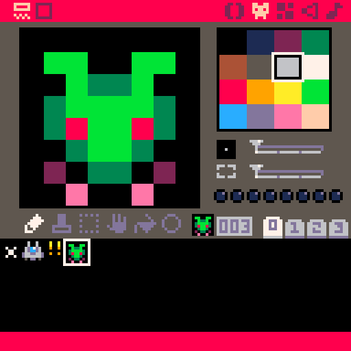
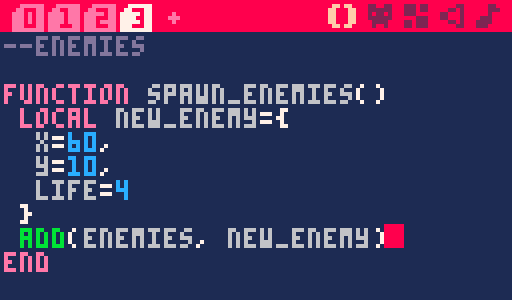
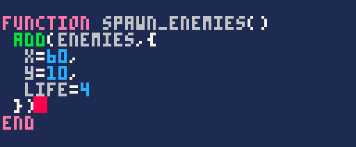
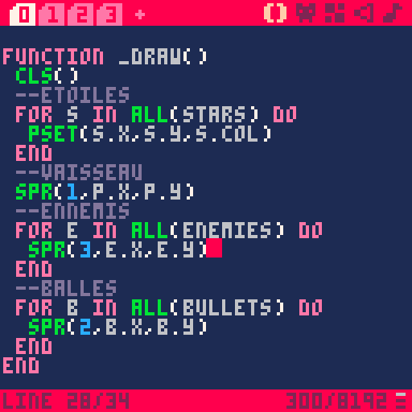
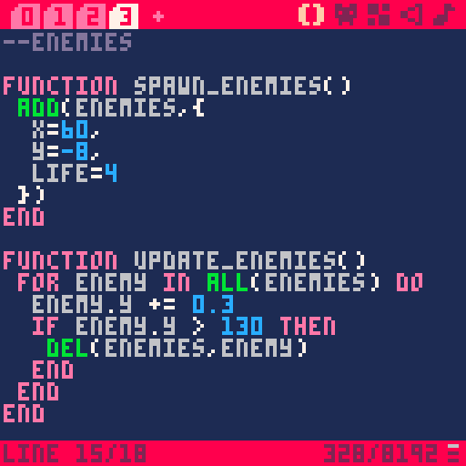
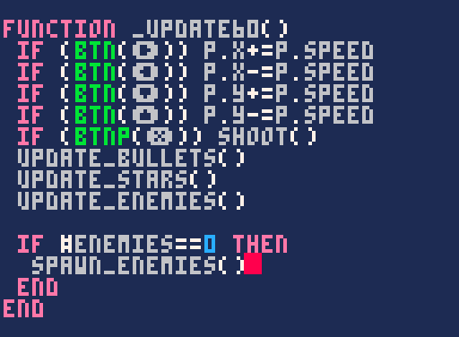

C'est le retour de l'atelier dessin ! Faites-vous plaisir et dessinez un petit sprite d'ennemi : un autre vaisseau, ou bien un alien...



Tout comme les balles et les étoiles, chaque ennemi sera un élément d'un tableau afin que l'on puisse agir sur chacun d'eux en même temps. Au début du jeu, déclarez ce tableau pour pouvoir ajouter des choses dedans plus tard :


Ensuite, créez un onglet appelé "*Enemies*" où l'on va ranger toutes nos nouvelles fonctions. Pour le moment, notre première fonction va simplement faire apparaître un ennemi au milieu de l'écran. Chaque ennemi aura une position X et Y ainsi que des points de vie qu'on utilisera plus tard.

Pour ajouter un ennemi au tableau `enemies`, vous pouvez l'écrire de deux façons équivalentes, selon votre préférence. Soit vous créez une variable locale séparément :



Soit vous faites tout d'un coup dans `add()`, ce qui est un peu plus court :



Pour tester rapidement ce que ça donne, appelez `spawn_enemies()` dans `_init()` et affichez les ennemis dans `_draw()`.


*Notre fonction draw s'agrandit ! Pour vous y retrouver, je vous invite à commenter ce qui s'y passe ou à séparer les éléments en plus petites fonctions.*

L'ennemi s'affiche bien. Maintenant, il faut le faire arriver du haut de l'écran, comme dans un vrai jeu ! On va plutôt mettre sa position de départ à -8 en Y, juste au-dessus de l'écran. Puis une fonction d'update va faire descendre chaque élément du tableau `enemies`, avant de les détruire s'ils atteignent le bas de l'écran. Si vous arrivez à bien suivre ce cours, ce n'est plus qu'une formalité !



N'oubliez pas d'appeler `update_enemies()` dans `_update60()` !

Pour l'instant, on fait apparaître l'ennemi juste une fois au début du jeu. On peut améliorer ça et faire en sorte que dès qu'il n'y a plus d'ennemi, que ce soit parce qu'on les a détruits ou parce qu'ils ont atteint le bas de l'écran, on en fait réapparaître.

Retirez la ligne `spawn_enemies()` de `_init()`. Rendez-vous dans `_update60()`, et écrivez ceci :



On ne le voit pas très bien, mais ce signe est un croisillon (eh oui, ce ne s'appelle pas vraiment un dièse ni un hashtag !). En Lua, `#` permet de connaître la longueur d'un texte ou le nombre d'éléments dans un tableau :

```lua
text = "bonjour"
#text  => 7
list = {"vache", "mouton"}
#list  => 2
```

:::profremi
Le double égal `==` est une vérification : « est-ce que cette variable est égale à 0 ? » par opposition au simple égal `=` que vous avez utilisé jusqu'ici et qui assigne une nouvelle valeur à la variable.
:::

:::winkastride
Retenez cette nuance : pour vérifier une égalité dans une condition, vous aurez toujours besoin du double égal.
:::

Dans notre cas, `#enemies` renvoie le nombre d'ennemis existant dans le tableau. Donc aussi simplement que ça, on peut savoir quand il n'y a plus personne et relancer le spawn !

Maintenant, vous pouvez laisser l'ennemi descendre et un autre réapparaîtra aussitôt. Mais tout ça me semble un peu trop pacifique... J'ai une sacrée envie de tirer dessus qui me démange. Voyons ça dans l'étape suivante !
