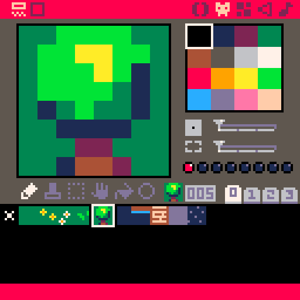
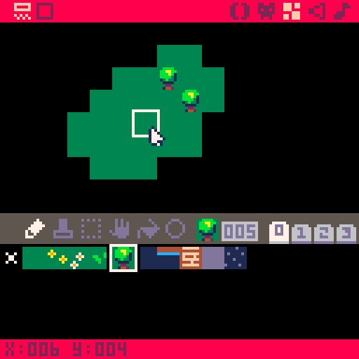
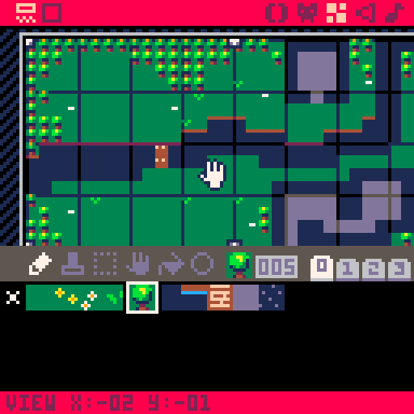
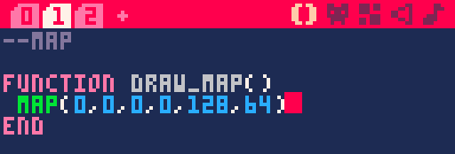
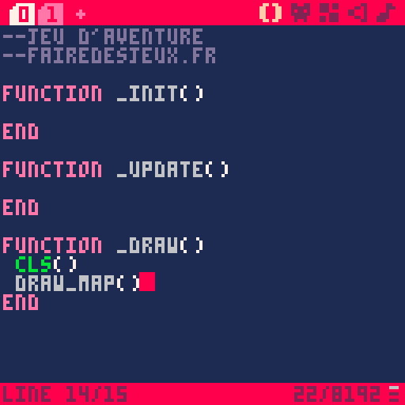

Dans ce chapitre, nous allons créer un petit jeu d'aventure ! Nous allons dessiner une carte que l'on pourra explorer, programmer un système de dialogue, interagir avec les objets du décor... Tout un programme ! Commençons par le commencement : la carte du jeu.

### Créer les sprites

Rendez-vous dans l'écran des sprites et dessinez les éléments qui composeront votre décor : un arbre, des murs, un sol d'herbe ou de pierre... Choisissez un univers qui vous plaît, tant que vous obtenez des tiles sur lesquels on peut marcher et d'autres qui sont des obstacles.



#### Les sprite flags

Sur la droite, vous pouvez voir une rangée de boutons qui ne semblent avoir aucun effet au premier abord : ce sont les flags, ou drapeaux en français.


*Flag 0 activé.*

Par défaut, ces flags n'ont aucune utilité : vous pourriez les activer et ça ne changerait rien. Cela dit, nous pouvons nous en servir dans notre code, par exemple pour indiquer quels sprites sont des obstacles que l'on ne peut pas traverser. Pour le moment, activez le flag 0 pour tous vos sprites d'obstacles, et nous nous en servirons lorsque nous coderons les déplacements du personnage.

### Opération mapping

Voici l'écran de création de map !



L'écran de PICO-8 peut contenir 16 tiles en largeur et en hauteur. Dessinez une zone d'au moins 32×32 tiles pour laisser de la place à l'exploration ! Pour vous aider à compter, les coordonnées du tile que vous survolez sont affichées en bas de l'écran.


*Pour vous déplacer, cliquez sur la molette ou maintenez Espace.*

:::remi
Attention ! La deuxième moitié de votre spritesheet et de votre carte occupent le même espace sur la cartouche. Cela signifie que si vous dessinez des sprites dans l'onglet 2 et 3, cela affectera la moitié basse de la carte et vice versa.
:::

### Afficher la carte

Ecrivons un peu de code pour afficher votre super carte. Commençons par établir les bases :


*Si vous avez besoin de vous rafraîchir la mémoire sur l'utilité de ces trois fonctions, retournez à la section adéquate du chapitre 1.*

Vous remarquerez que j'utilise `_update()` qui se joue à 30 FPS seulement. Pour ce jeu-là, cela me suffit, mais n'hésitez pas à changer pour 60 FPS selon votre préférence. Cela signifie juste que vous devrez diviser par 2 la vitesse de chaque animation dans le code.

La nouvelle commande dont nous aurons besoin est la suivante :

```lua
map(tile_x, tile_y, ecran_x, ecran_y)
```

Cette commande affiche la map en commençant par le tile précisé et à la position d'écran donnée. En bref, pour afficher la map à partir d'en haut à gauche, il suffit d'écrire `map(0, 0, 0, 0)` ou bien juste `map()`, pour faire court. Cela dessine toute la map, même si elle est plus grande que l'écran, mais ça n'a pas d'importance.

:::remi
Plus précisément, cette commande affiche la section réservée uniquement à la map dans la cartouche, qui fait 128×32 cases. Pour dessiner également la deuxième moitié qui est partagée avec la spritesheet, écrivez `map(0, 0, 0, 0, 128, 64)`.
:::

Vous trouverez d'autres façons d'utiliser cette commande dans le [manuel](https://www.lexaloffle.com/pico-8.php?page=manual#main_div:~:text=map%20cell_x%20cell_y%20sx%20sy%20cell_w%20cell_h%20%5Blayers%5D). Nous allons mettre tout ce qui concerne la carte dans un nouvel onglet.



Tout simplement ! Plus qu'à appeler cette fonction avant d'éventuellement vider l'écran à chaque frame.



Testez le jeu avec Ctrl+R, et magie, voilà votre carte !
