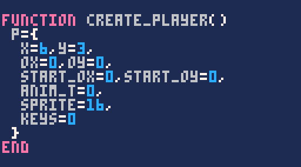
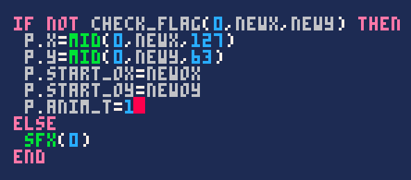
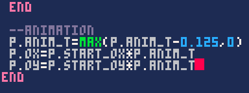
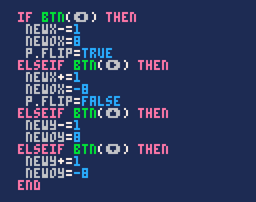

### Animer le personnage

#### Créer une position offset

Essayez de vous déplacer dans cette démo qui décompose ce que nous allons faire :

<iframe width="538" height="539"
  src="/jeux-pico-8/demo-offset/index.html">
</iframe>

La véritable position du personnage sur la grille, `p.x` et `p.y`, que l'on utilise pour détecter les collisions et interagir, ne changera pas. Elle est affichée en noir dans cette démo. Par contre, nous allons définir une position décalée de 8 pixels à chaque déplacement et qui reviendra progressivement à la véritable position. On l'appellera *offset* ; c'est le sprite blanc de la démo.

Remarquez que l'on autorise le joueur ou la joueuse à déplacer `p.x` et `p.y` seulement lorsque l'animation de l'offset est terminée. Ainsi, le sprite blanc se déplace de façon parfaitement fluide : on n'y voit que du feu !

Ajoutons les propriétés du personnage dont nous aurons besoin par la suite :



Pour vous donner une idée, les variables `ox` et `oy` représenteront la position actuelle de l'offset. `start_ox` et `start_oy` seront la position de départ de l'offset, au début d'un déplacement. `anim_t` vaudra 1 au début de l'animation, et ira jusqu'à 0 pour qu'elle se termine.

Commencez par placer l'offset de sorte à compenser chaque déplacement que l'on fait.

```lua
function player_movement()
    newx = p.x
    newy = p.y
    if btnp(⬅️) then
        newx -= 1
        newox = 8
        newoy = 0
    elseif btnp(➡️) then
        newx += 1
        newox = -8
        newoy = 0
    elseif btnp(⬆️) then
        newy -= 1
        newox = 0
        newoy = 8
    elseif btnp(⬇️) then
        newy += 1
        newox = 0
        newoy = -8
    end
```

Placez les conditions dans un `elseif` afin de dire au jeu de s'arrêter au premier bouton appuyé et ainsi d'interdire les déplacements en diagonale. Vous trouverez peut-être que l'on se répète beaucoup en écrivant tous ces `newox` et `newoy` mais rassurez-vous : c'est temporaire.

Plus bas, dans la condition qui vérifie la collison avant de déplacer `p.x` et `p.y`, nous pouvons aussi confirmer la position de départ de l'offset, et dire que l'animation commence en mettant `p.anim_t` à 1.



Cela dit, cette condition est actuellement vraie en permanence tant qu'il n'y a pas d'obstacle à "New X Y", même si nous sommes immobiles et que "New X Y" se trouve sous nos pieds. Nous devons faire en sorte que la condition se joue uniquement lorsque le joueur ou la joueuse tente de se déplacer, c'est à dire que "New X Y" n'est pas sous nos pieds.


Juste en-dessous, donc à la fin de la fonction `player_movement()`, ajoutez ce code qui anime l'offset.



La première ligne diminue `p.anim_t` au fil du temps jusqu'à atteindre 0. Plus nous diminuons `p.anim_t`, plus `p.ox` et `p.oy` deviennent petits, ce qui nous rapproche de la position réelle du personnage, et ce jusqu'à obtenir un offset de 0.

Lorsque nous affichons le personnage, nous devons maintenant prendre en compte l'offset :


Maintenant, l'animation de déplacement est fluide mais saute lorsqu'on maintient une flèche appuyée. C'est parce que jusqu'ici, nous déplacions le personnage à chaque fois que btnp était vrai. Maintenant, nous vérifierons plutôt les boutons quand `p.anim_t` est égal à 0, autrement dit quand l'animation est terminée.

```lua
function player_movement()
    newx = p.x
    newy = p.y
    if p.anim_t == 0 then
        newox = 0
        newoy = 0
        if btn(⬅️) then
            newx -= 1
            newox = 8
        elseif btn(➡️) then
            newx += 1
            newox = -8
        elseif btn(⬆️) then
            newy -= 1
            newoy = 8
        elseif btn(⬇️) then
            newy += 1
            newoy = -8
        end
    end
```

Au passage, cela nous permet de n'écrire qu'une fois `newox = 0` et `newoy = 0` !

Pensez aussi à changer les btnp en btn, pour que le jeu puisse réagir dès que l'animation est terminée.

#### Retourner le sprite

Pour changer la direction dans laquelle regarde le personnage quand il va vers la gauche, inutile de dessiner deux sprites différents : nous pouvons le retourner avec du code !

Comme le précise la [documentation](https://www.lexaloffle.com/pico-8.php?page=manual#main_div:~:text=spr%20n%20x%20y%20%5Bw%20h%5D%20%5Bflip_x%5D%20%5Bflip_y%5D), spr prend des paramètres optionnels, indiqués ici d'une `*`.

```lua
spr(numero, x, y, largeur*, hauteur*, miroir_x*, miroir_y*)
```

`largeur` et `hauteur` indiquent le nombre de sprites à dessiner côte à côte et valent chacun 1 par défaut.

Les deux derniers paramètres valent `false` par défaut et permettent d'inverser le sprite. Ce qui nous intéresse, c'est de passer `miroir_x` à `true` lorsqu'on se déplace vers la gauche, mais pour atteindre cet argument, nous devrons aussi renseigner ceux qui le précède :

```lua
spr(16, p.x*8, p.y*8, 1, 1, true)
```

Ceci n'est qu'un exemple pour vous montrer le principe. Bien sûr, nous ne pouvons pas le laisser à `true` tout le temps.

Nous allons ajouter une propriété "flip" au personnage.



Dans `draw_player()`, nous n'avons plus qu'à changer l'argument "miroir X" en fonction de l'état de `p.flip`.


Nous n'avons pas eu besoin de déclarer la variable `flip` dans le tableau `p` au début du jeu, puisque si la variable n'existe pas encore, l'argument vaudra tout simplement `false`.

#### Cycle de marche

La touche finale concernant notre personnage sera d'agiter ses gambettes lorsqu'il avance. Pour créer un cycle de marche simple, deux sprites suffisent largement. Pour ma part, ce sont les sprites 16 et 17.


Vous pouvez ensuite, à la fin de `player_movement()`, ajouter cette petite condition pour afficher le deuxième sprite pendant la première moitié de l'animation :


Pour un résultat plus comique, je vous suggère de remplacer la condition par `p.anim_t % 0.25 != 0`. Et pour aller plus loin au sujet des cycles de marche, je vous conseille d'étudier cette [démo](https://mboffin.itch.io/pico8-simple-animation) de MBoffin !

#### L'astuce des opérateurs logiques

Lorsque vous voyez la forme ci-dessus, avec une condition qui donne une certaine valeur si elle est vraie, et une autre si elle est fausse, sachez que vous pouvez l'écrire en une ligne avec des [opérateurs logiques](https://www.lua.org/pil/3.3.html).

```lua
variable = condition and 1 or 2
```

Si la condition est vraie, la variable vaudra 1, sinon elle vaudra 2. Donc plus concrètement :

```lua
p.sprite = p.anim_t >= 0.5 and 17 or 16
```

Ceci produit le même effet que la condition d'origine ! L'intérêt des opérateurs logiques est que vous pouvez les utiliser n'importe où, par exemple directement en tant qu'argument :

```lua
spr(p.anim_t >= 0.5 and 17 or 16, ...)
```

Vous n'avez pas à le faire si vous préférez la forme précédente. Mais c'est très bon à savoir !

### Animer la caméra

#### caméra mode 2 suit juste ox oy

#### caméra mode 1 déplacement smooth

### Bonus : déplacements pixel par pixel

Je vous ai montré comment faire des déplacements en case par case car cela peut être très pratique pour certains genres de jeux, mais aussi parce que c'est relativement simple à réaliser. Si vous souhaitez réaliser le même jeu mais avec des déplacements pixel par pixel, c'est un peu plus complexe à gérer au niveau des collisions.
