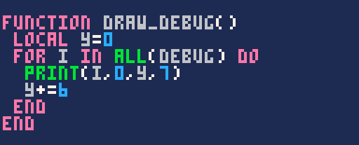

Parfois, notre code ne fait pas ce que l'on veut sans pour autant faire planter le jeu. Il peut alors être difficile de déterminer d'où vient le problème ! Pour vous aider, vous pouvez mettre en place un petit outil pour afficher le contenu de vos variables ou le résultat d'une fonction.

Cette fonction affiche le contenu du tableau `debug`, ligne par ligne en s'adaptant automatiquement à la longueur du tableau.

Il vous suffit alors de remplir le tableau par la méthode de votre choix (vous aurez peut-être besoin de déclarer `debug={}` dans init) pour que le résultat s'affiche en jeu.

### Statistiques de debug

Afficher vos propres variables est très pratique, mais cela ne suffira pas toujours à comprendre pourquoi votre jeu ralentit, par exemple. Pour cela, la fonction `stat(x)` renvoie une donnée du système différente selon la valeur de `x`.

`stat(0)` renvoie la quantité de mémoire RAM utilisée. Votre programme compilé et vos variables en jeu peuvent prendre jusqu'à 2 Mo, ou 2048 octets. Le résultat affiché peut donc aller de 0 à 2048.

`stat(1)` donne le pourcentage de processeur (CPU) utilisé **depuis le début de la frame**. Cette précision est importante : si vous demandez le CPU utilisé au tout début d'update, le nombre sera très faible, alors que si vous le demandez tout à la fin de votre code, il sera plus élevé. Un résultat de `1.0` équivaut à 100% d'utilisation. N'oubliez pas qu'à 60 FPS, chaque frame ne peut utiliser que la moitié du CPU avant que le jeu ne descende à 30 FPS.

`stat(7)` renvoie le framerate actuel, qui devrait donc être à 30 ou 60 si tout fonctionne bien. Simple comme bonjour !

Pour afficher ces valeurs sous la forme de pourcentages plus faciles à lire, vous pourriez écrire :

D'autres valeurs de `x` vous donneront des statistiques moins souvent utiles, comme la date et l'heure. Je vous laisse consulter la liste complète dans le [manuel](https://www.lexaloffle.com/pico-8.php?page=manual#main_div:~:text=stat%20x) !
