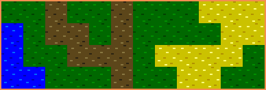

Hé oui, le fameux tile d'herbe... Il est souvent le premier tile réalisé car, sauf exception, tout le monde a besoin d'herbe dans un univers de RPG ! De plus, il s'agit d'une bonne entrée en matière et d'un bon moyen de s’échauffer, alors allons-y. Voyons différentes manières de dessiner de l'herbe :

*Un simple carré vert avec des points plus clairs.*

*Le même carré avec des lignes plus larges et quelques-unes plus sombres pour la profondeur.*

*Trois teintes pulvérisées alétoirement, puis une sélection 16×16.*

*Accumulation de brins avec les trois teintes pour obtenir un effet de direction.*

Il existe d'autres méthodes mais celles-ci sont les plus populaires. Je n'ai volontairement pas mis la méthode consistant à ne faire qu'un simple carré vert : à moins que vous ne partiez sur un style minimaliste, un carré vert ne ressemble pas vraiment à de l'herbe. Bien sûr, un joueur ou une joueuse se baladant au milieu d'arbres et de fleurs comprendra intuitivement que ce vert représente de l'herbe. Mais objectivement, cela pourrait aussi bien être du carrelage, une bâche ou de la peinture verte...

Ce problème persiste dans les deux premières méthodes représentées : ce n'est jamais qu'un aplat vert avec quelques tâches dessus. Ces méthodes ont en commun de produire des tiles ennuyeusement *plats*, contrairement à la quatrième méthode par exemple. Or, l'herbe est composée de milliers de petites tiges vertes poussant aléatoirement vers le ciel... C'est tout sauf plat, en somme, alors nous devrions le refléter dans nos tiles !

La quatrième méthode consiste à dessiner chaque brin d'herbe en alternant les couleurs, plus ou moins foncées. La technique est de le faire sans trop y penser, en faisant juste quelques traits au hasard de 4 pixels maximum. Vous pouvez tricher en réalisant seulement quelques brins pour les recopier partout sur le tile, puis en sélectionnant un nouveau morceau et le recopiant encore, pour donner une apparence aléatoire. J'utilise cette technique car elle permet d'avoir plus de contrôle sur l'apparence de l'herbe, tout en étant plus rapide.

La troisième méthode, consistant à pulvériser aléatoirement des pixels, peut paraître plus rapide, mais dans la pratique on obtient rarement un résultat correct du premier coup, et on finit par répéter l'opération en boucle !

La quatrième technique permet également de représenter facilement des hautes herbes, en dessinant de longs brins pour donner une impression de hauteur. Enfin, petite astuce, basculer le tile à 90° donnera des herbes aplaties, écrasées par des passants par exemple, et je pense que l'idée de pouvoir changer complètement la perception d'un tile rien qu'en le retournant est à garder à l'esprit !

:::hypemarvin
Ok, j'ai mon tile d'herbe...
:::

:::marvin
Et maintenant c'est un tile de terre !
:::

:::marvin
Et de l'eau ! Ha ha ha !
:::

:::hypemarvin
Et voilà le désert ! Je suis un GÉNIE !
:::

Non non non ! Jamais, au grand jamais, vous ne devriez faire ça ! Hormis le fait que ce n'est pas très beau, reprendre le même motif et varier les couleurs est trop répétitif. Vous pouvez utiliser la technique que vous souhaitez pour dessiner votre herbe, et il en existe encore plein d'autres... Mais souvenez-vous que le résultat ne doit ni paraître trop plat, ni être trop similaire à d'autres terrains.
