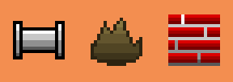
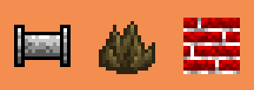
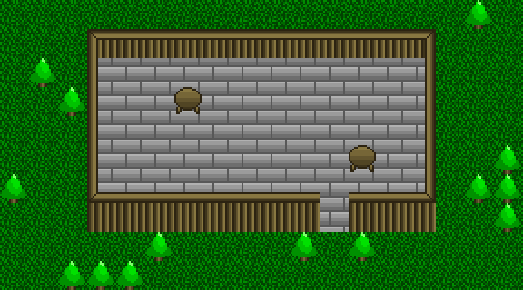
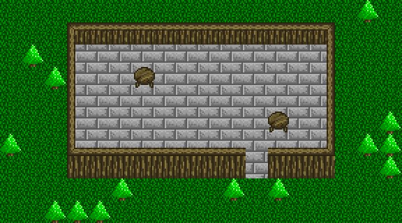

Désolé, mais l'outil dégradé est une création de Satan.

:::oofmarvin
Quoi ? Mais comment vais-je faire mes ombres sans lui ? Et mes effets de lumière ? C'est le meilleur outil de tous les temps !
:::

Ok, je vais préciser ma pensée. L'outil dégradé *peut* être bien utilisé... quand on comprend à quoi il sert.

:::hypemarvin
Regarde, j'ai dessiné le contour de ma montagne...
:::

:::marvin
Remplissage dégradé... et j'ai fini ! C'est tellement réaliste !
:::

Sincèrement, est ce que cela ressemble vraiment à une montagne ? Qui est faite de rochers, de pierres, de falaises... Pas vraiment.

Le principal problème réside dans l'utilisation de l'outil dégradé à outrance, ce qui donne des tuyaux parfaitement ronds, des montagnes toutes brillantes, des briques complètement lisses... Or regardez autour de vous : combien d'objets sont assez lisses pour mériter un dégradé aussi régulier ? Vos murs ont probablement des petites entailles et des égratignures, la peinture de votre chaise a peut-être légèrement pelé... A moins de faire un jeu dans un univers futuriste, où les objets sont neufs, les murs n'ont jamais été touchés et les sols ont été nettoyés par des robots maniaques, vous n'avez probablement pas besoin d’utiliser l'outil dégradé. Et je vais vous le prouver avec trois exemples, en utilisant les objets que j'ai mentionnés.

*Trois éléments remplis avec l'outil dégradé.*

Avec un peu d'imagination, on reconnaît un tuyau, une montagne et un mur de briques... Mais tous semblent faits d'un plastique brillant ! Si c'est l'effet recherché, l'outil dégradé est fait pour vous, mais s'il s'agit d'un décor avec un peu de vécu, vous préfèrerez réaliser des textures pixel par pixel :

Le tuyau est maintenant plus intéressant à regarder : on a gardé l'aspect rond, mais en moins lisse et plus texturé. La montagne quant à elle est nettement améliorée, grâce à des effets d'ombre utilisant les mêmes couleurs que l'outil dégradé, qui retranscrivent les différents rochers et pics. Enfin, le mur de briques semble plus réaliste, avec un aspect plus granuleux et rugueux qui correspond au matériau.

Est-ce pour cela que je déteste autant l'outil dégradé ? Eh bien pas seulement. Voyez-vous, ce ne sont pas tellement les tiles individuels qui sont ratés avec l'outil dégradé... C'est en les réunissant sur une map que cela devient un réel problème !

*Une cabane forestière avec des tiles en dégradé.*

Reprenons la même map avec des textures faites à la main :

Les textures de la seconde méthode sont plus intéressantes : le bois ressemble réellement à du bois, les arbres semblent avoir des feuilles et les briques grises ressemblent davantage à de la pierre. Bon, c'est vrai que la map n'est toujours pas très charmante, mais on parle ici seulement de texture, pas encore de composition !
