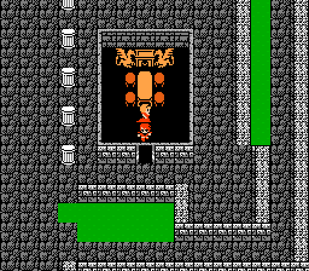
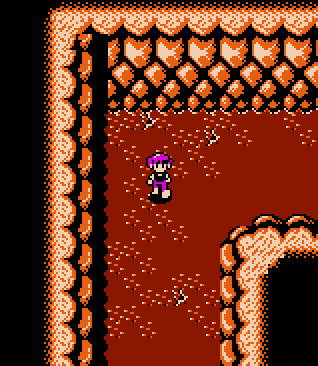
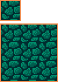
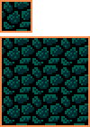
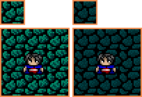
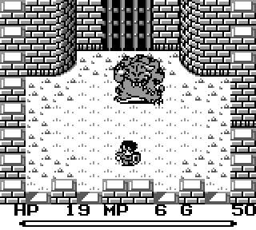
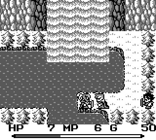

Oh mon dieu ! Qu'est-ce que c'est que cette horreur ? C'est Final Fantasy 1.

:::marvin
Ce cours était censé m'apprendre à faire du bon pixel art... Alors pourquoi étudier des jeux datant de la NES ? En plus ils n'utilisent que 16 couleurs, non ?
:::

Exactement, et c'est là que se trouve tout l'intérêt. A l'époque, les consoles n'avaient pas de palettes dépassant les 256 couleurs, on ne pouvait donc pas faire les fameux dégradés que l'on a vu dans la section précédente... Et c'est en cela que les vieux jeux sont intéressants à étudier : ils regorgent d'astuces que d'ingénieux et d'ingénieuses graphistes ont inventées pour rendre leurs tiles lisibles malgré cette contrainte.

Regardons d'un peu plus près ce Final Fantasy 1.

Le premier tile est celui du sol. Comme vous pouvez le voir, il ne parvient pas à effacer la grille, mais il faut dire que ce n'était pas une priorité à l'époque... Les développeurs et développeuses ne cherchaient pas encore à rendre leurs jeux beaux mais compréhensibles. Or en voyant ce tile sur la map, vous savez qu'il s'agit d'un sol et qu'il est fait de pierres ; pourtant il n'utilise que deux couleurs !

:::marvin
Mais si l'on n'a que deux couleurs, on peut uniquement faire les contours de rochers puis l'intérieur. Comment faire des effets d'ombrage ?
:::

Bienvenue dans le monde merveilleux du dithering ! Le dithering est l'action de réaliser des patterns de pixels de différentes couleurs pour donner une nouvelle teinte... Utilisé principalement aux commencements du jeu vidéo, le dithering reste une technique très utile quand vous êtes limités en nombre de couleurs.

Avant de voir comment réaliser du dithering, regardons le reste des tiles de FF1. Le second tile représente des briques plus claires, et utilise une troisième couleur : le blanc. Il est beaucoup plus clair que le troisième, qui utilise les pixels noirs pour représenter plus d'ombre, et représente la lumière avec des pixels gris plutôt que des pixels blancs.

Notez comment ces briques, avec seulement 2 ou 3 couleurs, parviennent à rendre des textures et des effets de lumière plus intéressants que l'outil dégradé ! Les briques ne semblent pas lisses mais usées par le temps et rugueuses.

Passons maintenant au dithering.

Ceci est un exemple de ce qui se fait de plus simple en matière de dithering. Si vous vous éloignez un peu de votre écran, vous diriez qu'il y a 3 teintes sur cette image. Pourtant elle n'utilise que des pixels blancs et noirs, mais un pattern en damier mixant les deux couleurs donne un gris. Ce n'est pas un magnifique gris, mais c'est du gris.

En l’occurrence le tile est très grossier, mais plus la résolution est grande, plus les pixels seront petits et donc plus l'effet sera réussi. Regardons comment nous pouvons nous en servir sur nos tiles :

Nous retrouvons notre premier mur dit « briques en plastique » toujours aussi lisse et brillant. Mais cette fois-ci, nous allons tenter d'adoucir le dégradé en utilisant le dithering entre chaque transition de couleurs... Ce qui nous amène au second mur, beaucoup plus agréable à regarder car il fait disparaître le dégradé grossier.

Nous pouvons faire encore mieux ! Si le dithering permet de créer de jolies ombres, il peut également nous aider à créer des textures intéressantes. Ainsi, en rajoutant deux teintes, nous parvenons à la fois à créer un aspect beaucoup plus rugueux et à camoufler encore plus le dégradé !

Pourtant les trois murs sont tous faits de quatre tiles composés de 16 pixels sur 16 pixels... Chaque brique ne fait que 7 pixels de haut ! Mais grâce au dithering, nous avons réussi à y apporter une texture et de meilleures ombres.

Jetons un œil à une image issue de Crystalis, un jeu plutôt disgracieux, mais qui illustre bien l'utilisation du dithering.

Notez comment la monotonie du sol est brisée par de la poussière, des brindilles... Dommage que le mur n'ait pas profité du même soin ; quelques fissures ou détails y auraient été bienvenus.

Sur les côtés de la carte, vous pouvez voir du dithering, tout d'abord allant du noir au orange, puis du orange au pêche. Sur les rochers, les transitions entre le noir et l'orange ne sont pas parfaites mais utilisent légèrement du dithering pour donner un aspect rugueux aux rochers.

Plus les rochers sont proches du sol, moins ils utilisent du pêche et plus ils semblent sombres. Ainsi, pour rendre des effets d'ombre, il leur suffit d'utiliser les trois couleurs intelligemment.

Tentons d'en apprendre un peu plus sur comment faire des ombres. J'ai réalisé un sol de cave pour l'occasion :

Je veux que cette cave semble vieille et sombre, effrayante donc... Pour l'instant ce n'est pas encore ça, c'est encore trop plat. Quelque chose ne va pas, mais quoi ?

La logique veut que si je prends un vert, que je le décline en trois teintes et que j'utilise la teinte foncée comme fond, mon sol aura l'air plus sombre. Pourtant cela ne fonctionne pas parfaitement...

A l'époque des palettes limitées, on utilisait davantage le noir. « Oui mais maintenant j'ai 1 milliard de couleurs, alors pourquoi j'utiliserais du noir ? » Eh bien car le noir est une couleur clé. Le noir permet d'attirer l’œil sur les couleurs qu'il entoure... Si vous n'en abusez pas, c'est un super outil pour créer du volume ou pour faire ressortir des éléments.

En supprimant la teinte la plus claire, pour ne garder que les deux plus sombres, tout en utilisant un fond noir, voici ce que j'obtiens :

Là, nous avons un sol sombre, effrayant et avec de vrais volumes. Le noir permet de séparer les rochers, d'améliorer le contraste général de la texture tout en assombrissant le tout.

Maintenant, regardons pourquoi j'ai choisi de supprimer le vert clair de mon sol :

Bienvenue dans le monde merveilleux du contraste, amusez-vous bien !

Dans la première version nous avons le fameux « Je n'ai pas lu ce tutoriel, je suis la logique évidente selon laquelle 3 teintes de vert et un fond noir rendront forcément bien ». Le problème de cette logique, c'est qu'elle ne prend pas en compte que nous parlons d'un sol, autrement dit d'un élément qui ne doit pas attirer l'œil autant qu'un mur ou un personnage. En utilisant des teintes allant du vert clair au noir, le contraste est trop élevé.

« Argh... Y a du vert partout... Et... Est-ce un personnage au milieu de ces rochers ? » Si votre joueur ou joueuse pense ça, il faut recommencer. Un joueur ne devrait pas penser au sol, et encore moins chercher son personnage au milieu de celui-ci. En utilisant des contrastes forts, le tile pourra être joli et avoir du volume, mais il ne fonctionnera pas en tant que sol dans un jeu vidéo.

Sur la seconde version, le vert médian est à peine plus clair que le noir constituant le fond. Le résultat est bien plus lisible ! Vous pouvez repérer facilement le personnage, et vous pouvez toujours comprendre le volume et la texture du sol.

L'idée à garder en tête est que le joueur ou la joueuse ne devrait jamais avoir besoin de plisser les yeux... Sinon, il ne sera plus impliqué dans le jeu et vous aurez détruit l'effet que vous veniez de créer avec une super histoire et des tiles effaçant la grille.

Quand on fait du pixel art, l'important est de voir le résultat en jeu, et non d'écouter sa logique et de réfléchir à quoi le tile devrait ressembler dans la réalité... Car souvent cela ne fonctionne pas.

Continuons notre analyse avec quelque chose d'encore plus basique que la NES :

La Game Boy. Une merveilleuse console limitant la palette de couleur à 4 nuances de gris. Ça c'est de la restriction !

J'ai un immense respect pour les artistes qui ont travaillé sur ces consoles... Regardez ce screen : on reconnaît parfaitement les remparts, l'herbe au centre, et pourtant le monstre tigre et le personnage se démarquent bien des décors. On peut même voir que notre personnage porte une armure et un bouclier ; l'herbe est également intéressante avec des traits de tailles variées... Le tout fait en seulement quatre nuances de gris (noir, gris foncé, gris clair, blanc) et un minimum de pixels !

Bien sûr, les tiles manquent de texture, la château semble comme neuf et on regrettera le manque de variations ou de fissures sur les murs... mais ne soyons pas si difficiles.

Ce qui nous intéresse ici, c'est de voir que malgré le peu de couleurs, les graphistes ont veillé à ce que les personnages se détachent du décor. Les tiles autour de la scène sont très clairs et contrastés, alors que les personnages sont plus sombres et moins contrastés.

Une autre scène incroyable, pour peu que l'on se rappelle qu'elle n'est constituée que de 4 couleurs.

Il manque, à la rigueur, une animation en bas de la cascade pour simuler l'écume. Tout de même, on retrouve une belle gestion des ombres à l'arrière de la cascade ; la chute d'eau présente une superbe utilisation du dithering ; les arbres sont très jolis...

Pour ce qui est du contraste, les pixels noirs sont quasiment exclusifs aux ombres fortes et aux contours des personnages. En résulte une scène très claire, où les personnages sont repérés très facilement.
