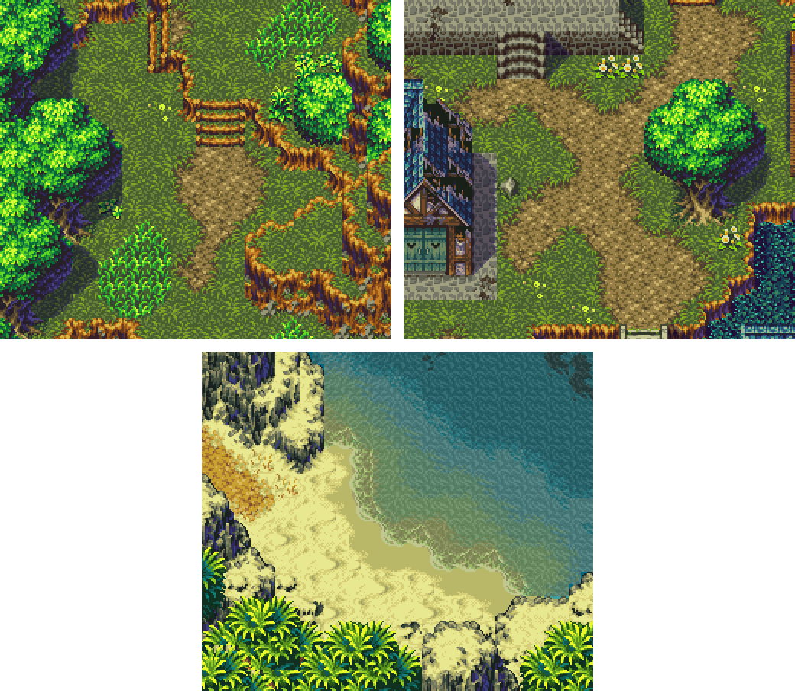
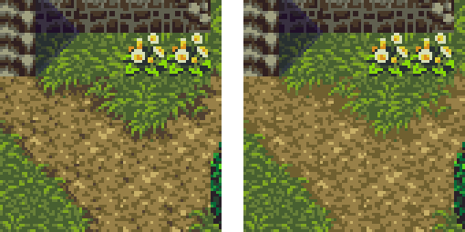
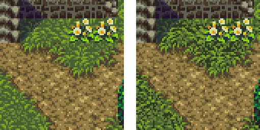

Si vous aimez les RPG, vous avez sûrement déjà joué aux icônes du genre. Ce qu'on va faire dans ce chapitre, c'est les décomposer pour voir ce qui les rend aussi iconiques.

Parlons de Secret of Mana 3, qui est probablement le jeu le plus beau que j'ai jamais vu :

Impressionnant, hein... Mais décomposons-le et voyons ce qui le rend *si* impressionnant.

Regardez le premier screen. Ignorez les arbres, les piles de terre et tout le reste, et concentrez-vous uniquement sur le sol. Pourquoi est-il différent des sols que j'ai faits plus tôt, comme celui du châlet dans la partie sur les dégradés ? La différence, c'est l'intérêt.

Si vous regardez le sol de plus près, vous remarquerez qu'ils ne se sont pas contentés de prendre un tile d'herbe et de remplir toute la map avec, mettre des arbres autour, et dire "Ok, c'est terminé. On a notre forêt." Rien que sur la première image, il y a peut-être bien quatre types de fleurs différents, et plusieurs motifs pour l'herbe, la terre et les herbes hautes !

Bien sûr, tout est extrêmement bien dessiné, mais ça ne veut pas dire que personne d'autre ne peut le faire. Prenons un morceau du screen et agrandissons-le. 

> Petite note au passage... Ce dont je parlais tout à l'heure, éliminer la grille. Eh bien Secret of Mana 3 l'a absolument fait. J'ai été obligé de découper mon screen au hasard parce que je n'avais aucune idée d'où commencent et finissent les tiles. Ça, mes amis, c'est une réussite.

Maintenant, concentrons-nous sur l'herbe. Comptez le nombre de couleurs utilisées. Trois. Eh oui, seulement trois, comme l'herbe que l'on a faite plus tôt dans ce cours. "Mais on dirait pas qu'il y a que trois couleurs ! Quand on regarde de loin, on dirait qu'il y a plein de teintes !" C'est vrai, mais souvenez-vous que ce n'est fait qu'avec trois teintes.

Regardez une des larges touffes d'herbe, avec les grands brins. Vous pouvez voir que les brins sont dessinés en grande partie avec le vert le plus clair. Ils ont aussi utilisé le vert intermédiaire pour souligner cette teinte claire, mais il y en a peu.

Maintenant, attardez-vous sur une zone qui semble plus plate, en bas au centre par exemple. Cette fois, ils n'ont utilisé que le vert foncé et le vert intermédiaire. Il n'y a que quelques points ici et là de teinte claire, pour donner l'illusion de brins d'herbe qui pointent, attrapant la lumière. Le reste est composé de pixels éparpillés. La plupart n'ont même pas la forme d'un brin d'herbe ! Vous pouvez voir des amas de vert intermédiaire qui ont la forme de carrés, de gribouillis, de tetrominos... Mais quand vous êtes en train de jouer, ça ressemble à de l'herbe. 

Ce que nous avons appris ici, c'est que pour que quelque chose ait l'air plus clair, vous n'avez pas besoin d'une teinte supplémentaire. Vous devez juste décider d'à quel point vous utilisez chaque couleur.

Prenons une autre zone, du deuxième screen cette fois :

Intéressons-nous à la terre cette fois. Il y a quatre teintes. La quatrième, la plus foncée, est utilisée rarement. Ce sont juste des pixels parsemés ici et là pour ajouter un peu de profondeur, comme un terrain irrégulier ou des amas de terre, ou souligner l'herbe, qui devrait, en théorie, projeter une ombre de toute façon. C'est juste placé à quelques endroits... mais ça fait plus que vous ne pourriez l'imaginer. Pour vous montrer un exemple drastic de tout ce que fait cette teinte à l'image, j'ai éclairci d'un cran la teinte la plus foncée :

"Qu'est-ce qui s'est passé ? C'est tout plat maintenant !" C'est vrai. Non seulement c'est plat, mais si vous plissez les yeux pour que les couleurs soient un peu floues, vous remarquerez que vous pouvez toujours dire où est l'herbe et où est la terre dans le screen original. Par contre, si vous regardez ma version éditée, vous voyez que la terre et l'herbe commencent à un peu trop se mélanger. 

Aussi, si vous regardez au centre de la terre, ça semble plus lisse, moins rocailleux qu'avant. C'est parce qu'il n'y a plus la teinte la plus foncée. 

Regardez de nouveau le screen d'origine et prêtez attention à où est placée cette teinte. Ce n'est jamais au hasard, entouré de teintes claires. C'est toujours placé près des autres teintes foncées. C'est comme si vous preniez ma version éditée, où j'ai retiré la teinte, et que vous la remettiez seulement là où se trouve le marron foncé. On dirait qu'il y a des trous de différentes profondeurs dans le sol... Et les plus profonds sont ceux qui auraient les pixels les plus foncés pour le montrer. Ça rend le terrain rocheux et surtout, ça propose plus de variations de profondeurs que l'herbe, parce que l'herbe n'utilise que trois teintes au lieu de quatre. 

A quoi est-ce que cela ressemblerait si l'herbe avait une quatrième teinte ? Eh bien j'en ai ajouté une ici : 

Maintenant, si vous comparez l'herbe, vous pouvez voir que l'herbe de gauche semble plus "volumineuse"... Comme si d'autres brins d'herbe se cachaient en dessous. Et ça peut être sympa... Mais plissez à nouveau les yeux et observez les deux images. 

Quelle herbe semble bien plus "gonflée" que l'autre ? L'herbe de gauche. Pourquoi ? Parce qu'elle n'a pas de quatrième teinte. Avec seulement trois teintes, l'herbe de gauche a beaucoup de "joli vert foncé" pour lui donner un "niveau" sur lequel se reposer. Là-dessus se rajoutent les teintes plus claires, ce qui donne l'impression que l'herbe vient de la couleur foncée. On décide mentalement que cette herbe doit être plus haute que la terre, puisqu'il n'y a pas de teinte qui dit "Cette texture s'enfonce dans le sol".

Dans l'image de droite, on a plus de mal à différencier l'herbe de la terre, puisque maintenant que l'herbe a une quatrième teinte, ça donne l'impression que ce n'est que de la terre verte.

Vous remarquerez aussi que j'ai utilisé bien plus de vert foncé qu'il n'y a de marron foncé... Ce qui donne l'impression que l'herbe est encore plus basse que la terre. C'est assez dur à dire mais si vous relaxez vos yeux, le chemin a l'air d'être au dessus de l'herbe. 

C'est un calcul mental naturel : si c'est plus clair, c'est plus près. Donc si la terre a moins de teinte foncée, elle a l'air plus claire et donc plus proche. L'herbe, qui est désormais un tas de pixels, semble repoussée. Tout ça à cause d'une teinte.

Passons désormais à l'arbre :

Pas mal l'arbre, hein ? Regardez-le de près, en commençant par la grande zone verte. En mettant de côté les pixels les plus foncés, pratiquement noirs, mis ici et là, vous avez cinq teintes de vert. Seulement cinq. "Mais ça ressemble tellement à... un arbre... et c'est... gonflé... Comment ?!"

Si vous vous reculez un peu, vous verrez comme des gros "tas" de feuilles, et pourtant elles ne sont pas séparées par des lignes noires ou que sais-je... On ressent juste leur présence. 

Eh bien ça marche de la même manière que la toute puissante sphère avec de la lumière. Vous avez probablement déjà vu ça absolument partout si vous avez regardé ne serait-ce qu'une seule fois les concepts d'ombre, mais je vais rapidement le refaire pour cet exemple :

Voilà une sphère avec une lumière qui se reflète dessus. Vous pouvez dire instantanément que la lumière vient frapper le coin en haut à droite parce que ce côté est plus clair, et l'opposé est, bien évidemment, plus foncé. On ressent la 3D, même si ce ne sont que des pixels, comme absolument tout ce qu'on a regardé depuis le début du cours.

Utilisons cette sphère pour recréer une partie de l'arbre : 

Ça a l'air 3D... Mais souvenez-vous, ce n'est qu'un tas de pixels à l'écran, comme ce texte. 

En regardant l'image, les sphères ont l'air d'être placées devant ou derrière les autres... Elles ont des "séparations". Elles sont toutes collées ensemble, mais on croirait vraiment qu'il y a différentes sections. 

Ce n'est pas fait en dessinant une ligne noire, c'est réalisé uniquement grâce à l'ombrage. Regardez le centre d'une sphère. Les pixels ont tous plus ou moins la même teinte, donc ça semble être un seul objet. Mais regardez maintenant là où deux sphères se chevauchent. 

Le changement de teinte est bien plus drastique. Les trois allant d'en haut à gauche à en bas à droite sont d'excellents exemples. De presque noir à pratiquement blanc. C'est pour ça qu'on a l'impression que ce sont des zones séparées.

Retournons à notre arbre maintenant :

