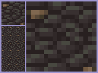
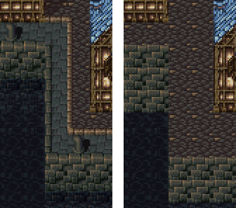
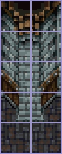
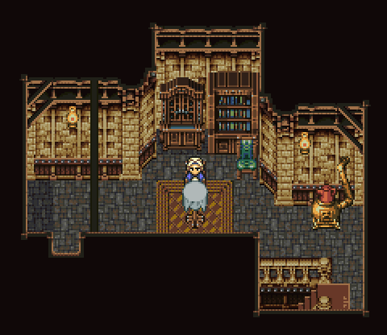

Final Fantasy VI est considéré comme le plus beau des FF originaux, et pour une bonne raison comme vous pouvez le voir :

Bon, c'est moins extravaguant que ce qu'on a vu tout à l'heure, je vous le concède. FF3 a été fait avant Secret of Mana 3, donc c'est normal qu'il soit moins impressionnant, mais si vous pouvez faire des graphismes comme ça, prenez ma place et écrivez ce cours. Commençons par examiner le screen en haut à gauche : 

C'est le tile de sol des sections importantes de la ville. En voici une version répétée, une version légèrement agrandie et une autre à 900%. En ignorant les pierres marrons pour le moment, les pierres grises consitent en... devinez combien de teintes... Quatre ! Surprise, surprise.

Il n'y a pas grand chose à dire sur ce tile, mais voyez comment la teinte la plus foncée est utilisée pour ombrer chaque pierre : juste une fine ligne d'un pixel ici et là. Chaque pierre est ensuite coloriée avec les autres teintes. Je vous laisse étudier ça par vous-même. Mais il y a un problème... Pouvez-vous voir la répétion des tiles ? Oui, vous le pouvez. Mauvais Squaresoft ! [MAUVAIS](https://www.youtube.com/watch?v=rGSVCdi4-L0) !! Mais, parce que le reste du jeu est si joli, on va laisser passer pour cette fois. 

Pour contrer cette pierre marron qui révèle la grille, ils auraient dû créer trois variations : un tile sans pierre marron, celui-ci avec les deux pierres, et un autre avec une seule pierre, peut-être en bas à gauche ou quelque chose dans le genre. 

Ecoutez-moi, en train de critiquer Squaresoft... Passons à la suite, parlons un moment de ce qui rend la map intéressante à regarder :

L'image de gauche est intéressante... Mais pourquoi ? C'est grâce à l'attention donnée aux détails. De ce que j'ai vu, les débutants qui essaient de faire un bout de ville dans ce genre, avec de l'eau, vont faire quelque chose comme sur le screen de droite.

Après tout, ça montre la même chose, que la ville est au bord de l'eau... Mais c'est bien plus ennuyeux. La version à gauche n'a pas seulement le chemin de pierre bleu et ardoisé, elle a aussi la brique orange pour le contour, ainsi qu'un alignement de briques pour compléter le look, sans parler des tuyaux pour encore plus d'intérêt.

Notez la partie du mur qui descend dans l'eau. A droite, c'est juste le même tile, puis l'eau. Alors qu'à gauche, la partie supérieure des briques est normale, la suivante est plus foncée, et ensuite l'eau chevauche les briques pour créer un effet translucide. L'eau ressemble donc plus à de l'eau qu'à du pétrole. Passons au deuxième screen : 

:::oofmarvin
Comment diable ont-ils faits ces rochers ?!
:::

Honnêtement, je n'en ai aucune idée... Je pourrais probablement diviser tous les tiles pour trouver lesquels ils utilisent où et combien il y en a, mais je vous laisse faire cet exercice... Si je m'étais lancé dans une telle entreprise, j'écrirais ce cours depuis ma tombe et je serais encore loin d'avoir fini.

Cependant, on peut toujours compter les couleurs ! Il y en a sept en tout, du violet le plus clair au noir le plus foncé. Pour obtenir un rendu plat, comme des rectangles de pierre proéminents, vous verrez qu'ils n'ont utilisé que les couleurs les plus claires. Les couleurs plates changent ensuite drastiquement vers les plus foncées et le noir est utilisé pour les ombres, tandis que les lignes assombrissantes fondent dans les ombres pour donner un effet 3D.

C'est tout ce que je vais dire sur ces roches... Je me demande combien de temps ils ont dû enfermer les artistes dans une cave avant qu'ils n'acceptent de travailler sur ce set. Le reste est fait de la même manière que les autres parties : à peu près quatre couleurs par type de tile. Vous pouvez ouvrir l'image, zoomer et faire quelques analyses. Attaquons-nous maintenant au troisième screen :

Là aussi, on peut dire beaucoup de choses quant à l'attention donnée au détail et à l'intérêt de l'image. Regardez où est la porte. Ce n'est pas juste un mur solide avec une porte et ensuite l'étage supérieur. La porte est entourée de larges tuyaux, avec un ventilateur au-dessus, des escaliers qui mènent à la porte, et puis ces... choses qui servent à... soutenir... au-dessus des tuyaux (je n'ai aucune idée de ce que c'est mais ça rend super bien), puis des briques carrées plus larges, et ensuite l'étage supérieur qui est aussi entouré d'une bordure de briques.

Aussi, sur la sorte de pont à gauche, il y a ces motifs triangulaires sur le côté. Ce n'est pas le même tile de briques que partout ailleurs !

On a encore plus de détails sur les colonnes à côté des tuyaux. Ce ne sont pas juste des colonnes : il y a des briques qui ressortent, des espèces de charnières en bas, puis des grilles en dessous (encore une fois, je n'ai aucune idée d'à quoi ça sert, mais ça rend le tout intéressant). 

Bien sûr, ils ruinent tout en utilisant ce tile de désert encore et encore et encore... Quelques pierres, ou des arbres morts, ou quelque chose, quoi ! aurait été bien pour briser la régularité.

Faisons donc un petit zoom sur les colonnes : 

Ces tiles utilisent neuf couleurs, mais ce sont toutes des nuances de gris et elles sont utilisées partout, donc ce n'est pas du gâchis. Si vous utilisiez neuf teintes différentes par tile, vous seriez vite à court avec une palette de 256 couleurs.

Au niveau des bords gauche et droit, les briques ne sont faites que de deux ou trois couleurs, et ce sont les teintes les plus foncées. Tandis que les briques du milieu, les plus claires, ont des couleurs brillantes et utilisent davantage de teintes. Moins il y a de détail, plus on a l'impression que c'est dans le décor (vous vous souvenez de l'herbe qui semblait plus plate avec moins de couleurs ?). 

Passons maintenant au dernier screen, l'intérieur. Laissez-moi vous montrer quelque chose d'amusant que je n'avais pas réalisé avant d'examiner les tiles :

Ces deux pièces sont très similaires, n'est-ce pas ? Pourtant, elles viennent de villes différentes et ont toutes deux une atmosphère différente : celle de gauche est froide et triste, et celle de droite est chaleureuse et accueillante. Tout cela alors qu'elles utilisent exactement les mêmes tiles, avec des couleurs différentes. Et ça marche, parce qu'elles sont utilisées dans deux villes totalement différentes. Quand vous arrivez à la deuxième ville, les tiles de la première ne sont plus frais dans votre esprit, et vous ne réalisez même pas que ce sont les mêmes. Ça a sûrement évité un paquet d'heures de dessin...

Bon eh bien, prenons une section du mur et observons-le tile par tile : 

Au premier coup d'oeil, on dirait que les piliers sont simplement composés d'une colonne de tiles. Mais il y en a en fait deux, ce qui rend le tout plus efficace. Si vous utilisiez une colonne de tiles pour les briques du milieu, alors il faudrait une colonne supplémentaire de chaque côté pour les murs en diagonale. L'avantage de cette méthode moins large est qu'elle rentre plus facilement dans la map.

Ici, pour faire ces coins en diagonale, ils utilisent une moitié du pilier ! L'autre moitié est la version du pilier qui est collée au mur. C'est une astuce très intelligente.

Si vous comptez un peu les couleurs (vous ferez ça très souvent pour devenir un·e meilleur·e pixel artiste), vous remarquerez à nouveau que peu de teintes sont utilisées, à l'exception de quelques pixels vraiments noirs.

Une autre caractéristique intéressante de ces maps d'intérieur, c'est la composition des plafonds. Regardez les coins... ils ont ces doubles poutres qui les traversent, et parfois il y a cette grande poutre qui passe verticalement au-dessus de tout. Aussi, les bordures ne passent jamais directement des tiles internes à des tiles noirs : il y a un contour en bois autour de toute la pièce. Encore une fois, c'est l'attention aux détails de ce genre qui rend les décors intéressants.

Notez aussi que les éléments supérieurs sont dessinés avec des teintes foncées de marron, et non des teintes claires. Si ça avait été le cas, elles seraient trop distrayantes et ruineraient le reste de la map. En plus, c'est assez réaliste par rapport à la position des lampes, mais la motivation principale était de ne pas les mélanger au reste du décor.

Nous avons fait une bonne analyse ! Je pourrais continuer pendant des heures à étudier des jeux comme Chrono Trigger, Zelda, Shining Force 2, Phantasy Star IV et ainsi de suite, mais ça prendrait une éternité et je ferais tout le travail à votre place...

Avec tout ça, vous devriez avoir appris comment étudier une map et comprendre comment elle est faite. Observez les couleurs utilisées, comment les sections sont divisées et les différents types de contraste. Avec le temps, cela devriendra plus naturel et vous serez capable de trouver combien de teintes ou de tiles sont utilisées en un simple coup d'oeil. C'est un talent très important pour avancer dans l'art.
