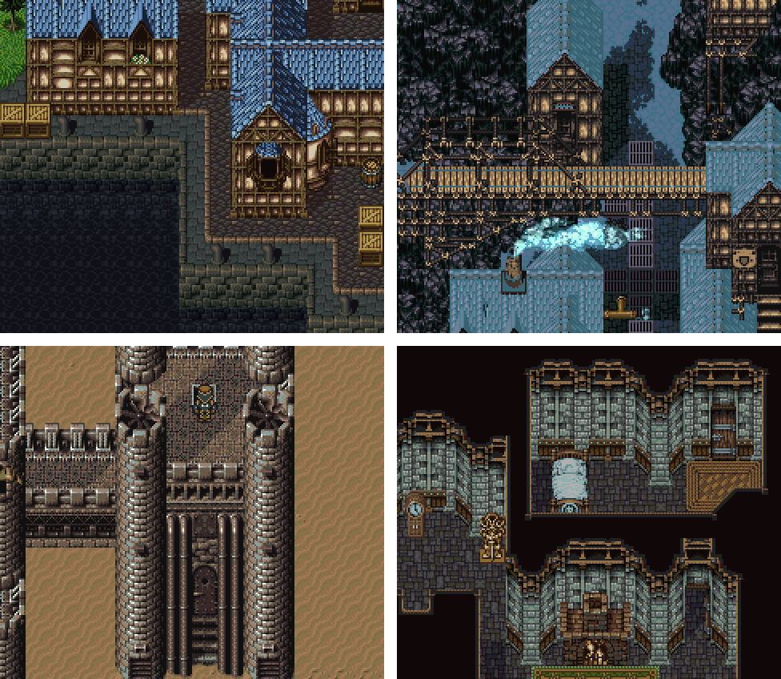
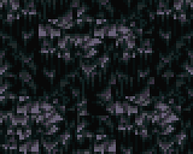
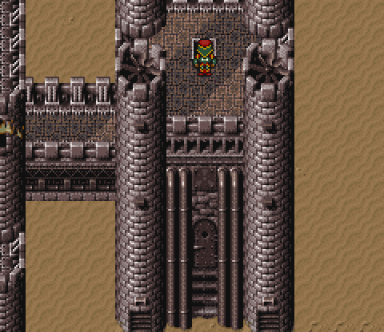

Hailed a la meilleure apparence des Final Fantasy originaux, et pour une bonne raison comme vous pouvez le voir :

FF3 est moins extravaguant que Secret of Mana 3, mais SoM3 a été fait après, donc c'était attendu.

Bref, FF3 n'est pas aussi impressionnant, mais si vous pouvez faire des graphismes comme ça, prenez ma place et écrivez ce cours. Enfin, on est là pour apprendre de ces screens, donc commençons par celui en haut à gauche : 

C'est un tile de sol des sections importantes de la ville. J'ai une version répétée, une version légèrement agrandie et une version à 900%... En ignorant les pierres marrons pour le moment, les pierres grises consitent en... Devinez combien de teintes... Quatre. Surprise, surprise.

Il n'y a pas grand chose à dire sur ce tile, mais voyez comment la teinte la plus foncée est utilisée pour ombrer chaque pierre... Juste une fine ligne d'un pixel ici et là. Chaque pierre est ensuite faîte avec les autres teintes. Etudiez ça par vous-mêmes. Mais notez la version répétée... Pouvez-vous voir les tiles ? Oui, vous pouvez. Mauvais Squaresoft ! MAUVAIS !! Mais, parce que le reste du jeu est si joli, on va laisser passer pour cette fois. 

Comme vous pouvez le voir, utiliser la pierre dans le tile fait apparaître la grille. Pour contrer ça, ils auraient dû ajouter un tile sans pierre marron, celui-ci avec les deux pierres, et un autre avec une seule pierre, peut-être en bas à gauche ou quelque chose dans le genre. 

Ecoutez-moi, je suis en train de critiquer Squaresoft... Bref la suite, parlons "intéressant" un instant : 

Regardez l'image de gauche. C'est intéressant... Mais pourquoi ? C'est grâce à l'attention donnée aux détails.

De ce que j'ai vu, les gens qui essaient de faire un bout de ville comme ça, avec de l'eau, vont faire quelque chose comme sur le screen de droite.

Ça montre la même chose, que la ville est au bord de l'eau... Mais c'est bien plus ennuyeux. L'autre n'a pas seulement le chemin de pierre bleu et ardoisé, il y a aussi la brique orange pour le contour, ainsi qu'un alignement de briques pour compléter le look, sans parler des tuyaux pour encore plus d'intérêt.

Notez la partie du mur qui descend dans l'eau. A droite, c'est juste le même tile, puis l'eau. Alors qu'à gauche, la partie supérieure des briques est normale, la suivante est plus foncée, et ensuite l'eau chevauche les briques pour créer un effet translucide. L'eau ressemble donc plus à de l'eau qu'à du pétrole. Je voulais juste le souligner une seconde. Passons au deuxième screen : 

La grande question que vous vous posez, c'est probablement "Comment diable ont-ils faits ces rochers ?!"

Je n'ai honnêtement aucune réelle idée... Je pourrais probablement diviser tous les tiles pour trouver lesquels ils utilisent où et combien il y en a, mais je vous laisse faire cet exercice...

Si je m'étais lancé dans quelque chose comme ça, j'écrirais ce cours depuis ma tombe et je serais encore loin d'avoir fini.

Cependant, on peut compter les couleurs. Il y en a sept en tout... Du violet le plus clair au noir le plus foncé. Pour avoir un rendu plat, comme des rectangles de pierre proéminants, vous verrez qu'ils n'ont utilisés que les couleurs les plus claires.

Les couleurs plates changent ensuite dramatiquement vers les plus foncées et le noir est utilisé pour les ombres, tandis que les lignes assombrissantes fondent dans les ombres pour donner un effet 3D.

C'est tout ce que je vais dire sur ces roches... Je me demande combien de temps ils ont dû enfermer les tile artistes dans la cave avant qu'ils acceptent de travailler sur ce set. Le reste est fait de la même manière que les autres parties... A peu près quatre couleurs par type de tile. Glissez l'image dans Paint, zoomez et faîtes quelques analyses.

Maintenant pour le troisième screen : 

J'ai envie de souligner ici aussi l'attention donnée au détail et l'intérêt de l'image. 

Regardez où est la porte. Ce n'est pas juste un mur solide avec une porte et ensuite l'étage supérieur. On a la porte, entourée de larges tuyaux, il y a un ventilateur au dessus, des escaliers qui mènent à la porte, ces... choses qui servent à... soutenir... au dessus des tuyaux (je n'ai aucune idée de ce que c'est mais ça rend super bien), puis des briques carrées plus larges, et ensuite l'étage supérieur qui est aussi entouré d'une bordure de briques.

Aussi, sur la sorte de pont à gauche, il y a ces motifs triangulaires sur le côté des briques, ce n'est pas juste le même tile de briques que partout ailleurs.

Encore plus de détail, sur les colonnes à côté des tuyaux, ce ne sont pas juste des colonnes, il y a ces briques qui ressortent, des espèces de charnières en bas puis des grilles encore en dessous (encore une fois, je n'ai aucune idée d'à quoi ça sert mais ça rend le tout intéressant). 

Bien sûr ils ruinent tout en utilisant ce tile de désert encore et encore et encore... Quelques pierres ou des arbres morts ou quelque chose aurait été bien pour briser les zones un peu.

Voilà un zoom des colonnes : 

Ces tiles utilisent neuf couleurs, mais ce sont toutes des nuances de gris et elles sont utilisées partout donc ce n'est pas une perte. Si vous utilisiez neuf teintes par tile, vous seriez vite à court avec une palette de 256 couleurs.

Notez les extrêmes gauche et droite... Les briques ne sont faîtes que de deux ou trois couleurs, et ce sont les teintes les plus foncées. Tandis que les briques du milieu, les plus claires, ont les teintes brillantes et utilisent plus de teintes. Moins il y a de détail, plus on a l'impression que c'est dans le décor (vous vous rappelez de l'herbe qui semblait plus plate avec seulement deux couleurs plus tôt dans le cours ?). 

Passons maintenant au dernier screen :

Voilà quelque chose d'amusant que je n'avais pas réalisé avant de vraiment regarder les tiles... Vous voyez des similarités entre ces deux pièces ? Elles viennent de différentes villes et ont toutes les deux une atmosphère différente : celle de gauche est froide et délabrée, celle de droite est chaleureuse et accueillante.

Pourtant elles utilisent exactement les mêmes tiles, avec des couleurs différentes. Et ça marche, parce qu'elles sont utilisées dans deux villes totalement différentes. Quand vous arrivez à la deuxième ville, les tiles de la première ne sont plus frais dans votre esprit, et souvent vous ne réalisez même pas qu'ils utilisent les mêmes tiles. Et ça a sûrement évité un paquet d'heures de dessin... 

Bien que les tiles soient foncièrement les mêmes, vous pouvez distinguer les maisons d'une ville à une autre grâce au changement de palette. 

Bon eh bien, prenons une section du mur et observons-le tile par tile : 

Voilà un des piliers... Au premier coup d'oeil, on dirait qu'un pilier est juste composée d'une ligne de tiles allant vers le haut... Mais il y a en fait deux tiles, ce qui rend le tout plus efficace. Si vous utilisez une colonne de tiles pour les briques du milieu, alors il faudrait une colonne supplémentaire de chaque côté pour les murs en diagonale. 

En utilisant deux colonnes, les sections diagonales font partie des tiles du pilier, ce qui veut dire qu'elles rentrent mieux sur la map, vu qu'elles demandent une colonne de tiles en moins.

Le problème avec cette méthode cependant, c'est que la seule manière d'avoir une autre diagonale à la suite (pour que cette partie de la maison continue en diagonale un peu plus longtemps que pendant ce petit morceau), c'est de faire une colonne spéciale de briques diagonales qu'ils pourraient répéter. Mais aucune des maps ne fait ça, elles ont toujours ces sections avec un seul tile.

Si vous regardez le screen de la pièce de droite, juste au dessus, vous verrez que pour faire une bordure en coin (comme celui tout à gauche dans le screen), ils n'utilisent que la moitié de la colonne. Donc ils ont de nouveau deux moitiés, et pour faire une large poutre au milieu du mur comme juste au dessus du lit dans le screen de gauche, ils mettent juste ces deux moitiés dos à dos. Tout est dans l'assemblage. 

Bref, je voulais juste souligner la composition de cette scène. Si vous faîtes un peu de comptage de couleur, vous ferez ça énormément si vous voulez devenir un meilleur pixel artist, vous remarquerez encore, et à l'exception de quelques pixels vraiments noirs, que peu de teintes sont utilisées.

Une caractéristique intéressante des maps d'intérieur, c'est la composition des plafonds... C'est plus évident dans le screen de droite, au dessus. Regardez les coins... ils ont ces doubles poutres qui traversent, et de temps en temps il y a cette poutre qui va verticalement au dessus de tout... 

Aussi, les bordures ne vont jamais seulement des tiles internes à des tiles noires. Il y a un contour en bois autour de toute la pièce. Encore une fois, c'est l'attention aux détails de ce genre qui rend les choses intéressantes.

Notez aussi que les poutres supérieures et autres sont faîtes avec des teintes foncées de marron, et non des teintes claires. Si ça avait été le cas, elles seraient trop distrayantes et ruineraient le reste de la map. De même, si les lampes au mur étaient placées sous des poutres dans la réalité, elles n'éclaireraient pas la partie supérieure des poutres, donc c'est réaliste. Mais surtout, ça les empêche de trop se mélanger avec le reste du décor.

Bon, assez avec l'analyse. Je pourrais continuer pendant des heures à étudier des jeux comme Chrono Trigger, Zelda, Shining Force 2, Phantasy Star IV et ainsi de suite mais ça prendrait une éternité et je ferais tout le travail à votre place... 

Avec tout ça, vous devriez avoir appris comment étudier une map et voir comment elle est faite. Observez les couleurs utilisées, comment les sections sont divisées et les différents types de contrastes et de choix de couleurs. Avec le temps ça devriendra plus naturel et vous serez capable de trouver combien de teintes ou de tiles sont utilisées avec un simple coup d'oeil. C'est un talent très important pour avancer dans l'art.
