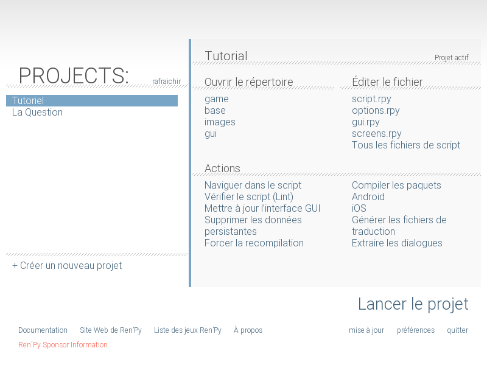
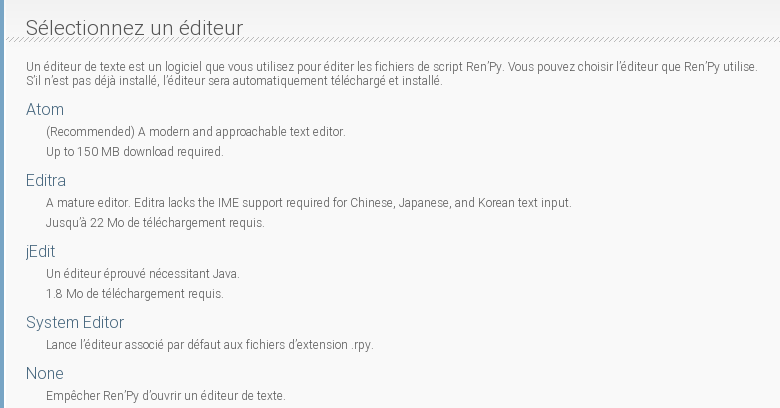
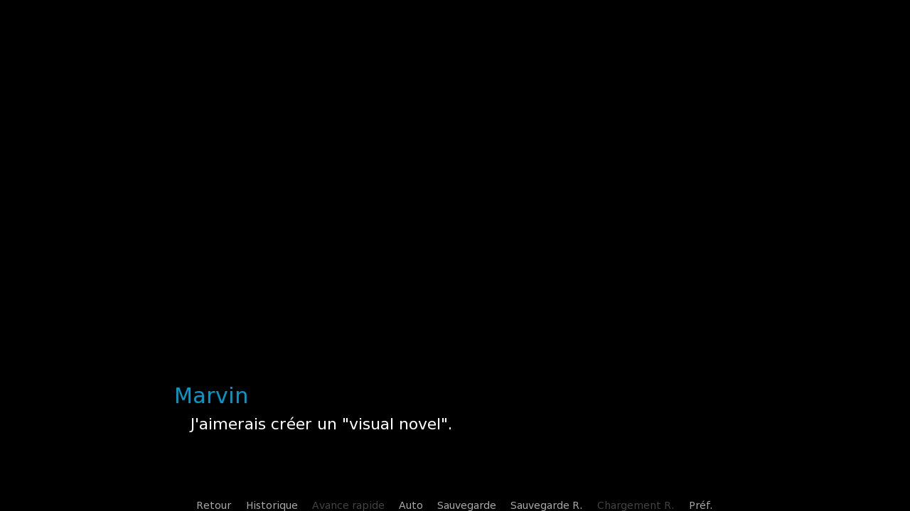

Dans ce premier chapitre, nous allons créer en quelques minutes un dialogue complet entre plusieurs personnages.

[[Video src="/videos/renpy/01-debuter-dans-renpy/demo.mp4" muted loop controls poster="/videos/renpy/01-debuter-dans-renpy/poster.png"]]
*Le résultat final de ce chapitre.*

### Télécharger le logiciel

Pour commencer, rendez vous sur la [page de téléchargement](https://renpy.org/latest.html) de Ren'Py.

Cliquez sur le bouton vert pour obtenir la dernière version du logiciel pour votre système d'exploitation. Une fois le téléchargement terminé et l'archive extraite, vous devrez exécuter le fichier `Renpy.exe` (sous Windows), `Renpy.sh` (sous GNU/Linux) ou `Renpy` (sous macOS).

La fenêtre qui s'ouvre devant vous est le lanceur de Ren'Py (ou *launcher*). Vous pouvez le passer en Français en cliquant sur "Preferences" en bas à droite.



Deux projets sont déja disponibles : le tutoriel donne plein de renseignements assez poussés sur toutes les possibilités de Ren'Py, tandis que "La Question" est une petite histoire d'exemple avec deux personnages et différents décors. N'hésitez pas à l'essayer et à examiner son script !

:::winkastride
Ces deux projets contiennent aussi des images que vous pouvez récupérer pour vous entraîner.
:::

### Créer son projet

Cliquez sur "Créer un nouveau projet". Ren'Py va alors vous demander plusieurs informations : emplacement où créer le projet, son nom... Laissez-vous guider puis patientez pendant que le moteur génère les fichiers. Vous pouvez ensuite lancer le jeu pour découvrir ce qu'il contient !

### Ouvrir le script du jeu

Comme une pièce de théatre ou un film, un visual novel suit un script contenant tous les dialogues, les informations sur les décors, les personnages... Lorsqu'un joueur lance le jeu, celui-ci va suivre le script du début à la fin en réalisant les instructions que vous y aurez indiquées.

Pour modifier ce fameux script, cliquez sur `script.rpy` en haut à droite du launcher. Ren'Py va alors vous demander quel éditeur de texte vous souhaitez utiliser.

:::hypemarvin
Un éditeur de texte ? Comme Word ?
:::

:::astride
Non, il s'agit plutôt d'un éditeur de code, comme ceux qu'on utilise en programmation.
:::



Ne vous tracassez pas sur le choix de l'éditeur au début : ils se ressemblent tous quand on débute. Je vous conseille de choisir Atom pour commencer, mais vous pouvez utiliser n'importe quel éditeur, comme [Visual Studio Code](https://code.visualstudio.com/) ou [Emacs](https://www.gnu.org/software/emacs/) par exemple, en cliquant sur "System Editor" et en sélectionnant votre éditeur préféré comme logiciel par défaut pour ouvrir les fichiers `.rpy`.

Vous voilà donc dans le fichier de script ! Il contient déjà du texte qui ressemble à ceci :

```renpy
# Déclarez les personnages utilisés dans le jeu.
define e = Character('Eileen', color="#c8ffc8")

# Le jeu commence ici
label start:
    e "Vous venez de créer un nouveau jeu Ren'Py."
    e "Après avoir ajouté une histoire, des images et de la musique, vous pourrez le présenter au monde entier !"
    return
```

Nous verrons au fur et à mesure comment tout cela fonctionne, mais vous pouvez déjà remarquer quelques petites choses. Les lignes commençant par un `#` sont des commentaires : c'est du texte qui n'est pas lu par Ren'Py et qui sert simplement à vous repérer dans votre script. Tout à la fin, l'instruction `return` déclenche la fin du jeu : en atteignant cette ligne, vous retournez à l'écran-titre.

### Un premier texte

Je vous propose d'effacer le contenu par défaut pour que l'on écrive quelque chose ensemble :

```renpy
label start:
    "Dans une contrée lointaine, très lointaine..."
    "Marvin" "J'aimerais créer un \"visual novel\"."
```

La première ligne `label start:` est importante. Une instruction de label (étiquette en français) permet de nommer un endroit dans votre script : en l'occurence, le label `start` permet d'indiquer le début du jeu à Ren'Py.

Après le `label start:`, toutes les lignes sont décalées : on appelle ça l'indentation. Vous pouvez les écrire avec 4 espaces ou avec la touche Tab. Cela signifie que toutes ces lignes font partie du bloc de `label start:`.

Les lignes suivantes sont des instructions de dialogue. Les noms entre guillemets sont facultatifs mais pratiques pour indiquer au joueur qui parle. Ils sont suivis par des textes également entre guillements qui seront les dialogues.

Lorsqu'un texte contient des guillemets doubles comme dans le second texte, ces caractères doivent être précédés d'un `\` pour indiquer à Ren'Py qu'ils font partie du dialogue. Sinon, le jeu ne pourrait pas savoir à quel guillemet le texte est censé se terminer.

Retournez sur le launcher pour essayer votre jeu. Vous avez affiché votre premier texte !


*C'est un bon début !*
