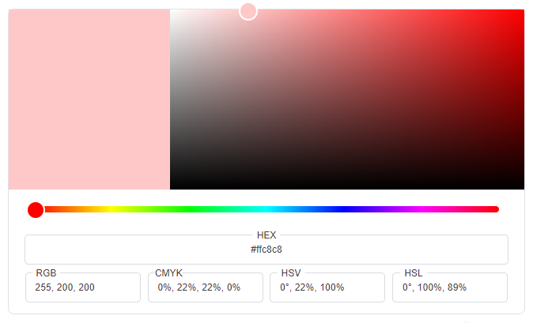

Tout à l'heure, nous avons vu que pour écrire le nom du personnage qui parle, on écrit ceci :

```python
"Marvin" "J'aimerais créer un \"visual novel\"."
```

Mais devoir recopier `"Marvin"` à chaque ligne risque bien vite de devenir ennuyeux. C'est pourquoi on va déclarer notre personnage et lui donner un petit nom de raccourci, ici `m`. Ecrivez ceci tout en haut de votre script :

```python
define m = Character("Marvin", color="#ffc8c8")
```

Comme vous le voyez, on peut aussi préciser la couleur du nom quand il est affiché en jeu. Cette valeur qui commence par un `#` est un code hexadécimal, aussi utilisé dans le webdesign ou les logiciels de graphisme. `#ffc8c8` correspond à un rouge pâle, mais vous pouvez choisir votre propre couleur en cherchant "sélecteur de couleur" sur Google par exemple.


*Le sélecteur de couleur de Google.*

Maintenant que le personnage est défini, on peut écrire les dialogues plus rapidement !

```python
define m = Character("Marvin", color="#ffc8c8")
define a = Character("Astride", color="#c8c8ff")

label start:
    m "J'aimerais créer un \"visual novel\"."
    m "Mais je ne sais pas par où commencer..."
    a "Je peux t'aider si tu veux !"
```


*Le nom est bel et bien rouge pâle.*

Dans la prochaine partie, nous allons enrichir le jeu avec des illustrations et des musiques.

[Suite](images-et-sons)
