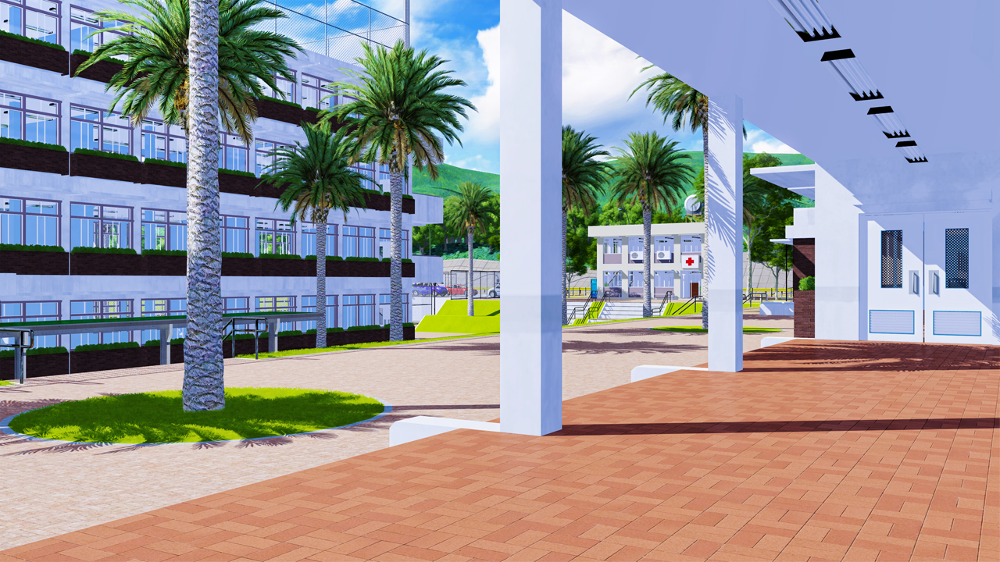
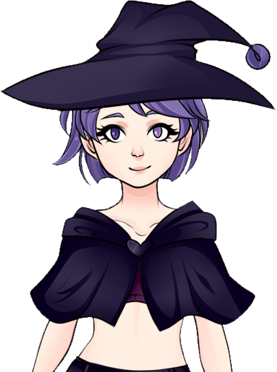
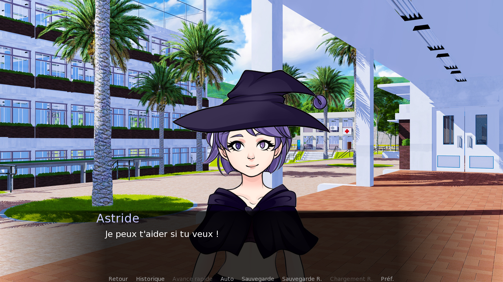

C'est bien beau de savoir faire un dialogue, mais sans illustration, on s'ennuie un peu ! Nous allons ajouter l'image du personnage qui parle, un arrière-plan, et une musique.

### Ajouter des fichiers

Pour ajouter des fichiers à votre projet, retournez sur le launcher Ren'Py pour ouvrir le répertoire `game` : c'est le répertoire principal de votre projet.

Ajoutez un fichier de musique directement dans ce dossier. Ren'Py supporte les formats Opus, Ogg Vorbis, MP3 et WAV.

Pour ajouter les images, entrez dans le dossier `images`, qui devrait être vide pour le moment. Voici les deux images que je vais utiliser dans ce cours, mais n'hésitez pas à créer les vôtres.


*ecole.jpg (provient du jeu "La Question")*


*astride.png (créée avec [ce générateur](http://www.rinmarugames.com/playgame.php?game_link=witch-apprentice-creator))*

La première image vient du jeu "La Question" et le personnage vient de .

### Afficher les images

Bien ! Afficher une image est très simple. Pour afficher le fond, écrivez `scene` suivi du nom de votre image. Pour le personnage, écrivez `show` puis le nom.

```python
scene ecole
show astride
```



Essayez votre jeu, et vous verrez que les images s'affichent soudainement. On pourrait ajouter un fondu pour rendre ça plus élégant. A la suite d'une commande pour afficher une image, écrivez `with` pour qu'elle s'affiche avec une transition :

```python
scene ecole
with dissolve

show astride
with dissolve
```

`dissolve` est un fondu classique, mais il existe bien d'autres transitions (voir la [documentation](https://www.renpy.org/doc/html/transitions.html)).

Il y a plusieurs façons d'utiliser `with`. Dans l'exemple ci-dessus, `ecole` va s'afficher en fondu, puis `astride` s'affichera en fondu à son tour. Mais vous pourriez également faire en sorte que les deux images s'affichent en fondu en même temps :

```python
scene ecole
show astride
with dissolve
```

> **Note :** Pour des exemples plus avancés, vous pouvez consulter la [documentation de `with`](https://www.renpy.org/doc/html/displaying_images.html#with-statement).

### Jouer une musique

Pour jouer une musique de fond, il suffit d'écrire cette commande :

```python
play music "darude - sandstorm.mp3"
```

Pensez bien à écrire l'extension du fichier pour les musiques. On peut également jouer un simple bruitage avec `play sound`, ou encore préciser une durée de transition grâce à `fadein`.

```python
play music "mozart.ogg" fadein 1.0
play sound "woof.mp3"
play music ["a.ogg", "b.ogg"] # La musique a.ogg sera jouée, puis la musique b.ogg
```

Pour arrêter la musique, utilisez l'instruction `stop` suivie si vous le souhaitez d'une transition `fadeout`.

```python
stop music
stop sound fadeout 1.0
```

Si la musique vous gêne pendant que vous travaillez, pas de problème : vous pouvez la couper dans les préférences du jeu.

On a bien avancé ! Si vous êtes perdu·e, voici un petit récapitulatif de ce que pourrait donner un script complet :

```python
define m = Character("Marvin", color="#ffc8c8")
define a = Character("Astride", color="#c8c8ff")

label start:
    play music "rock.opus"

    scene ecole
    with dissolve

    m "J'aimerais créer un \"visual novel\"."
    m "Mais je ne sais pas par où commencer..."

    show astride
    with dissolve

    a "Je peux t'aider si tu veux !"
```

Dans la partie suivante, on va pimenter le jeu en ajoutant des choix de dialogue.
