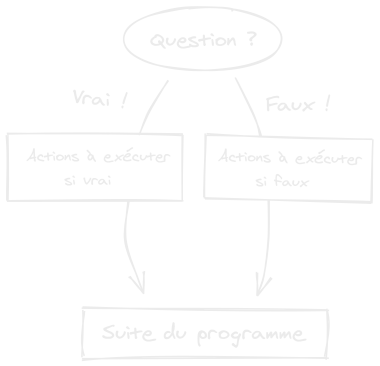

Vous savez déjà faire des choix en créant un `menu`. Cela dit, il seraient plus utiles si les personnages du jeu pouvaient se souvenir de vos réponses et vous en reparler plus tard. C'est exactement ce que nous allons faire ici !

### Préparation

Voici les nouvelles images que je vais utiliser, si vous souhaitez avoir les mêmes que moi :


*chambre.jpg (provient de [ce site](http://www7b.biglobe.ne.jp/~osumashi/free_bg.html))*


*amelie.png (créée avec le même [générateur](http://www.rinmarugames.com/playgame.php?game_link=witch-apprentice-creator) que précédemment)*

Préparons le terrain avec une scène toute simple :

```renpy
define mar = Character("Marvin", color="#ffc8c8")
define ame = Character("Amélie", color="#f4cdb5")

label start:
    scene ecole
    show amelie
    ame "Bonjour Marvin ! J'ai une question à te poser."
```

Maintenant, Amélie va nous demander si on aime le chocolat, et nous allons enregistrer la réponse dans une variable. La variable restera intacte même si vous sauvegardez puis rechargez votre partie. Ainsi, on pourra réutiliser la réponse plus tard dans le jeu.

### Créer une variable

Cette variable ne pourra avoir que deux états : soit on aime le chocolat, soit on n'aime pas. On peut donc en faire un booléen, qui s'appelle `aime_le_chocolat` et qui vaut vrai ou faux (`True` ou `False`). Déclarons la variable avec une valeur de base. On commence la ligne par un `$` pour dire que l'on va écrire une instruction en Python :

```renpy
$ aime_le_chocolat = False
```

En Python, on ne dit pas directement si la variable est un booléen, un entier ou un texte. On lui assigne tout simplement une valeur, et le programme déduira quel est le type de la variable. En écrivant `True` ou `False`, la variable devient donc automatiquement un booléen.

```renpy
label start:
    scene ecole
    show amelie
    ame "Bonjour Marvin ! J'ai une question à te poser."

    $ aime_le_chocolat = False

    menu:
        ame "Est-ce que tu aimes le chocolat ?"
        "Oh oui !":
            $ aime_le_chocolat = True
            ame "C'est super, moi aussi j'adore ça !"
        "Beurk, non !":
            ame "Non, sérieusement ?"
```

Si on répond oui, on change la valeur de `aime_le_chocolat`. Si on répond non, pas besoin de la changer : elle valait déjà `False` !

Parfait ! Il ne nous manque plus qu'à créer une scène qui arriverait plus tard dans le jeu.

```renpy
label anniversaire_de_marvin:
    scene chambre
    with dissolve
    show amelie
    with dissolve

    ame "Joyeux anniversaire ! Tu peux ouvrir ton cadeau."
```

Selon la valeur de `aime_le_chocolat`, Marvin obtiendra un cadeau différent. Mais comment vérifier cela ?

### Les conditions

En programmation, une condition vérifie une question. Si la réponse est "vrai", le programme exécute des commandes. Si la réponse est "faux", le programme peut exécuter d'autres commandes.



Dans notre cas, la question que l'on veut poser est : « Est-ce que `aime_le_chocolat` vaut `True` ? » Sur Ren'Py, on l'écrit ainsi :

```renpy
if aime_le_chocolat == True:
    ame "Je sais que tu aimes les chocolats, alors je t'en ai acheté !"

"Suite de l'histoire"
```

Remarquez qu'on écrit un double égal `==`. En fait, un égal simple `=` permet de donner une nouvelle valeur à la variable, comme nous l'avons fait plus haut, tandis qu'un double égal `==` permet de vérifier la valeur actuelle de la variable, sans la changer. C'est une nuance dont il faut se rappeler !

N'hésitez pas à tester la condition pour vous rendre compte de son fonctionnement !

Actuellement, Marvin ne reçoit de cadeau que s'il aime les chocolats. Nous devons ajouter un "sinon" à la condition, pour dire ce qu'il se passe quand `aime_le_chocolat` vaut `False`.

```renpy
if aime_le_chocolat:
    ame "Je sais que tu aimes les chocolats, alors je t'en ai acheté !"
else:
    ame "Je ne savais pas trop quoi t'offrir, alors voici un vélo !"
    mar "Comment ça, un vélo ??"

"Suite de l'histoire"
```

:::marvin
Cette Amélie a l'air très gentille, mais elle est un peu bizarre !
:::

Vous savez maintenant comment retenir des informations binaires (vraies ou fausses) au cours de votre jeu. Mais bien sûr, vous pourriez parfois avoir besoin de retenir des informations plus complexes, comme des nombres. C'est ce que nous allons voir dans l'étape suivante !
