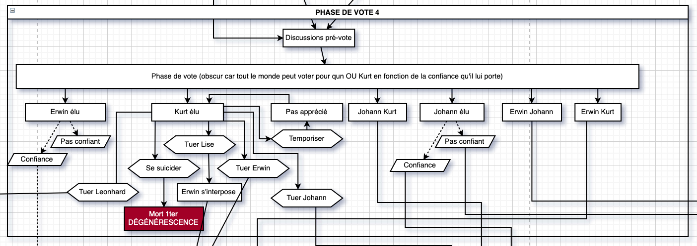
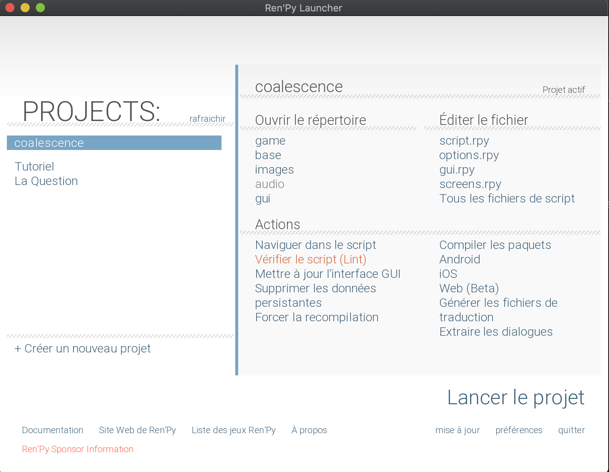

Même s'il fait bon se lancer enfin dans son propre projet, écouter les conseils des vieux sages rodés à Ren'Py ne vous fera pas de mal non plus !

### Faites un graphe

Un visual Novel, ça part rapidement en cacahuète. Si on n'y met pas un minimum de soin, ou qu'on se laisse emporter par la folie créatrice, il est courant d'avoir des problèmes scénaristiques.

Pour cela, faire un **graphe** des routes peut être un bon moyen de s'y retrouver. Vous n'imaginez pas écrire l'histoire suivante sur un éditeur de texte !

Vous pouvez utiliser les outils suivants :

-   [Diagrams.net](https://app.diagrams.net) (très complet)
-   [Excalidraw](https://excalidraw.com/) (simple et joli)

Vous pouvez aussi le faire au papier et crayon, mais ce sera moins facile à corriger si vous changez votre histoire.

### Travaillez votre univers

Une histoire, ce n'est pas seulement ce que le joueur va lire. C'est aussi des personnages, un univers ! N'hésitez pas à **mettre toutes vos idées sur papier** (ou numérique, l'important est de l'écrire quelque part). Vous verrez plus rapidement les points forts et points faible de votre histoire, et cela vous aidera à garder une ligne scénaristique cohérente !

### Pensez à votre joueur ❤️

Même s'il peut être tentant de maîtriser le **rythme** de votre Visual Novel, laissez votre joueur libre au maximum. Par exemple, ajouter des pauses obligatoires (qu'on ne peut pas passer) est souvent une mauvaise idée. De manière générale, laissez-le au maximum maître de votre jeu. Essayez de vous mettre à sa place, comme si vous découvrez votre propre jeu !

> N'hésitez pas à faire tester votre jeu par des proches, même avant de l'avoir fini !

### Utilisez le Linter

Si le _launcher_ Ren'Py fonctionne, rien ne dit que tout va bien marcher plus tard... Utilisez le Linter du _launcher_ pour éviter de futurs bugs rapidement !

> Le linter ne signale pas toutes les erreurs de **logique**, mais il va vous aider en détectant les erreurs de **syntaxe** !
