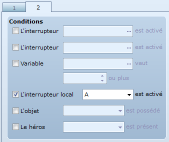

Après avoir installé RPG Maker, familiarisez-vous grâce à cette vidéo qui vous apprendra rapidement à faire un premier jeu.

`youtube:https://www.youtube.com/watch?v=HKXL-0i7uAM`

### Addendum : désactiver un évènement

Après avoir suivi la vidéo, vous avez peut-être remarqué un problème... Quand on retourne sur l'évènement invisible qui joue la scène de combat, il se déclenche à nouveau. Or, nous voulons qu'il ne puisse se déclencher qu'une seule fois. Voici donc une astuce pour désactiver un évènement.

Pour effacer un évènement temporairement, utilisez la commande "Effacer cet évènement" à la fin de l'évènement. Avec cette méthode, en quittant la carte puis y retournant, l'évènement réapparaîtra. C'est tout à fait normal car la commande Effacer cet évènement **n'a pas un effet permanent.**

Si vous préférez désactiver définitivement votre évènement, au lieu d'utiliser la commande "Effacer cet évènement", utilisez "Modifier un interrupteur local" afin d'activer l'interrupteur local A. Ensuite, créez une **nouvelle page** dans votre évènement, que vous laisserez vide. Dans les conditions d'activation de cette nouvelle page vide, cochez l'interrupteur local A. Ainsi, après s'être joué, l'évènement sera bloqué indéfiniment dans une page 2 qui n'exécute rien. Votre problème est réglé !

*Création de la deuxième page vide.*

Manipuler les pages avec des interrupteurs se révèlera très utile pour mettre en scène votre jeu. Nous allons donc expérimenter plus en détail sur ce sujet dans l'étape suivante !
