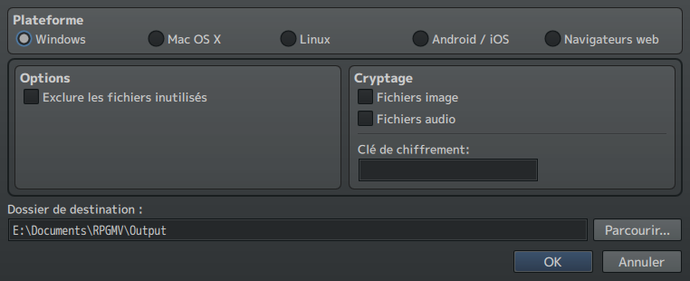

Votre premier jeu est terminé. Il est temps de l'exporter pour le partager à vos amis !

### Sur RPG Maker MV

#### Nettoyer le dossier du projet

En créant un projet, RPG Maker MV copie toutes les ressources graphiques et audio par défaut dans le dossier du jeu. C'est pourquoi vos projets pèsent plus de 300 Mo par défaut, alors que votre jeu n'utilise pas la plupart de ces ressources ! Par exemple, vous n'utilisez probablement pas toutes les musiques, toutes les images d'écran titre ou encore toutes les animations d'attaque, qui sont pourtant des fichiers assez lourds.

Avant toute chose, ouvrez donc le dossier de votre projet et faites un petit nettoyage des fichiers inutiles. Vous pourrez toujours retrouver les fichiers supprimés dans le dossier d'installation de RPG Maker MV, ou bien en créant un nouveau projet.

#### Déployer le jeu

Le dossier de votre projet contient toutes les données du jeu mais pas d'exécutable pour y jouer directement. Vous ne pouvez donc pas partager ce dossier tel quel.

Dans l'éditeur, ouvrez le menu Fichier et cliquez sur Déploiement. Choisissez le système d'exploitation désiré et le dossier de destination.

L'option "Exclure les fichiers inutilisés" tente de nettoyer le dossier automatiquement, mais la méthode de tri fait beaucoup d'erreurs. Par exemple, si vous avez laissé la liste des animations par défaut dans la base de données, alors toutes les images d'animation seront incluses à votre projet. De plus, le logiciel ne peut pas détecter les fichiers utilisés par les scripts à moins que les programmeurs aient correctement déclaré les fichiers dans le code, ce qui n'est pas toujours le cas. Vous l'aurez compris : cocher l'option est moins efficace qu'un nettoyage à la main, et pourrait causer des bugs.

#### Créer une version web

Vous aurez sans doute remarqué l'option pour produire un jeu jouable sur navigateur. C'est un grand avantage de RPG Maker MV : cela vous permet de montrer le jeu à des amis sans leur demander de télécharger quelque chose, et d'avoir une seule version qui fonctionne sur tous les systèmes d'exploitation tant qu'il y a un navigateur. Vous pouvez mettre en ligne votre jeu web sur des sites gratuits : consultez notre cours sur itch.io pour plus d'informations.

### RPG Maker VX Ace

Sur RPG Maker VX Ace et les versions antérieures, le logiciel, les ressources et les jeux sont trois entités séparées. Les ressources graphiques et audio par défaut sont assemblées dans un paquet appelé RTP pour Run-Time Package. Le RTP est inclus dans l'installation du logiciel mais peut aussi être téléchargé gratuitement depuis le site officiel.

Logiciel | RTP    | Jeu
---------|--------|-----
30 Mo    | 200 Mo | 5 Mo

En créant un projet, RPG Maker VX Ace n'inclut pas le RTP directement mais stipule dans le fichier Game.ini que le jeu en a besoin pour fonctionner. Dans ce cas, le jeu lit les données du RTP depuis son emplacement d'installation.

Cette segmentation des données est pratique pour se partager rapidement des jeux entre collègues possédant déjà le RTP. Cependant, pour la distribution au grand public, c'est plus délicat. Ce ne serait pas très professionnel de demander aux joueurs d'installer eux-mêmes le RTP depuis le site officiel. Pour inclure le RTP à son jeu, il existe deux méthodes.

#### Compilation automatique

Cette méthode est la plus simple, mais sans doute la moins idéale. Depuis RPG Maker VX Ace, dans le menu Fichier, cliquez sur "Compiler le jeu". Choisissez un dossier de destination et cochez "Inclure les RTP". Le logiciel produit une [archive auto-extractible](https://fr.wikipedia.org/wiki/Auto-extractible) à l'interface peu accueillante. A l'intérieur de cette archive se trouve le jeu et tous les fichiers du RTP. Il est donc recommandé de supprimer les images et musiques inutiles avant la distribution.

#### Inclure le RTP manuellement

Ouvrez le fichier Game.ini situé dans le dossier du projet. La ligne `RTP=RPGVXAce` indique au jeu qu'il doit chercher les ressources dans le RTP installé sur l'ordinateur. Supprimez cette ligne et hop ! votre jeu indépendant ! En lançant le jeu, vous aurez probablement des messages d'erreur indiquant un fichier manquant. En effet, vous devez maintenant ajouter vous-même les fichiers du RTP dont vous avez besoin. Le RTP est généralement installé au même endroit que le logiciel. N'oubliez pas d'inclure le dossier Fonts et d'y ajouter vos polices personnelles si vous en utilisez.
