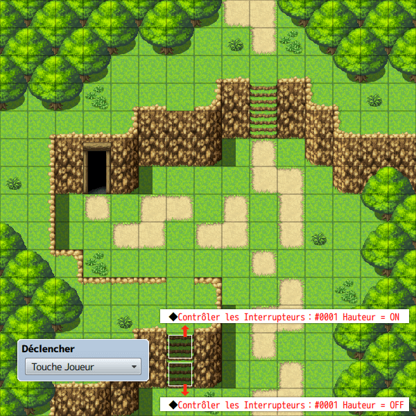
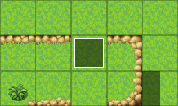
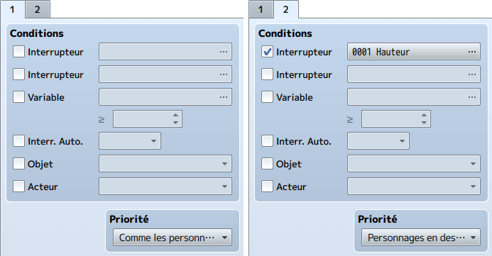
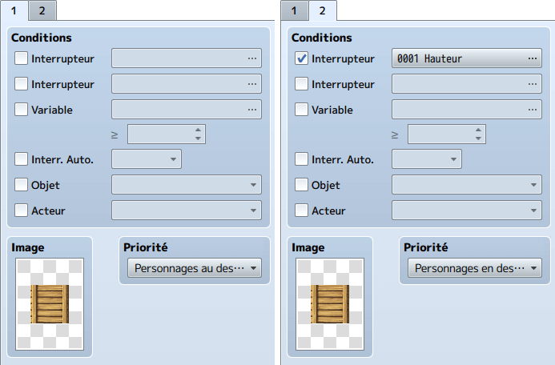
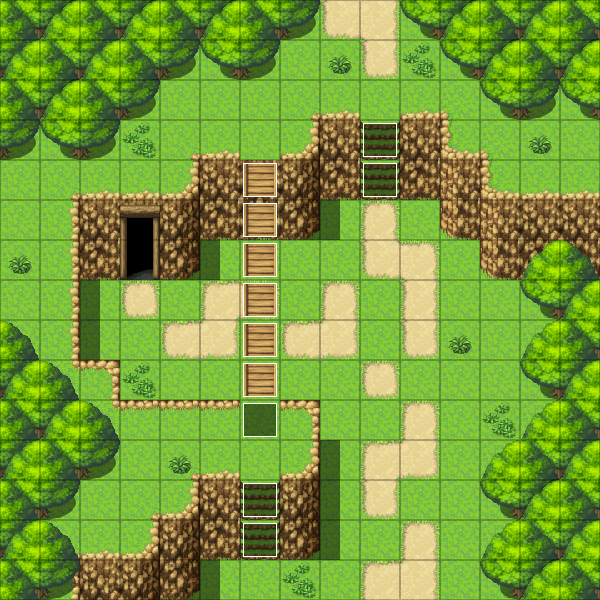

Cette section explique comment faire des ponts avec deux modes : on pourra passer en-dessous ainsi que les traverser. Cette astuce fonctionne sur tous les RPG Maker.

[[Video src="/videos/rpg-maker/pont.webm" muted loop controls]]

### Hauteur du personnage

Nous allons détecter quand le joueur est situé en hauteur ou en bas, ce qui nous servira plus tard à choisir un des deux modes du pont.

A l'endroit où le joueur change de hauteur, nous créons deux évènements invisibles qui auront tous deux le déclenchement *Touche Joueur* ou *Touche Evènement*. Un des évènements va activer un interrupteur appelé `Hauteur`, tandis que l'autre évènement va désactiver l'interrupteur.

Vous pouvez vérifier que cela fonctionne en testant le jeu et en appuyant sur F9 pour consulter l'état des interrupteurs. En montant les escaliers, `Hauteur` est activé, tandis qu'en redescendant, il est désactivé.

### Passabilité aux extrémités

Comme les bordures de falaise sont configurées pour nous empêcher de passer, nous ne pourrions pas emprunter le pont. On place donc des cases d'herbe aux extrémités du pont. Pour éviter que le joueur puisse traverser cet endroit lorsqu'il est en bas (`Hauteur` sur OFF), on va créer un évènement qui le bloque dans ce cas précis.

Dans la première page, l'évènement et le joueur sont au même niveau, ce qui rend la case impassable. Dans la deuxième page, active lorsque le héros est en hauteur, l'évènement est placé en-dessous, ce qui rend la case passable.

### Création du pont

Chaque case du pont est un évènement. On peut donner à l'évènement l'apparence d'une case de pont dans le tileset B. Dans la première page, le pont sera au dessus des personnages, tandis que dans la seconde page, il sera en-dessous pour que l'on puisse marcher dessus.

Vous pouvez copier-coller cet évènement plusieurs fois pour faire votre pont :

### Passabilités du tileset

En testant le jeu, vous remarquerez qu'une fois sur le pont, vous pouvez en sortir à gauche ou à droite. Nous pouvons l'empêcher en paramétrant les passabilités du tileset. Ouvrez le tileset dans la base de données, puis cliquez sur le bouton *Passage 4 directions*. Paramétrez les ponts ainsi :

Lorsque vous marcherez sur le pont, l'évènement respectera les passabilités du tileset. Votre système est terminé !

