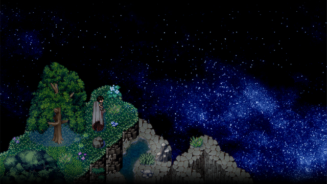
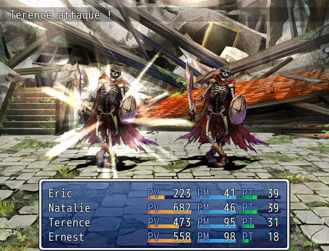

RPG Maker est un logiciel permettant de créer des JRPG en 2D, mais pas que ! On reconnaît le style de ce logiciel entre mille : il s'est forgé une réputation autour de ses musiques et graphismes inclus, qui simplifient beaucoup la création. Il propose également un système de combat au tour par tour qui imite les RPG old school.

Si l'on met le système de combat de côté, le logiciel permet aussi de réaliser des jeux narratifs centrés sur l'exploration des cartes. Certains jeux de ce type ont connu un fort engouement dans la sphère indé, notamment les célèbres *To the Moon* et *Yume Nikki*.

*To the Moon (RPG Maker XP)*

Une autre grande particularité de RPG Maker est qu'il n'est pas nécessaire de coder pour réaliser son aventure : la logique du jeu est conçue en cliquant sur des boutons. Cela dit, en utilisant un langage de script, les programmeurs et programmeuses peuvent dépasser les limites du logiciel. RPG Maker MV utilise le langage JavaScript tandis que les versions précédentes utilisent Ruby. Et même si vous ne savez pas coder, la communauté a produit beaucoup de scripts (ou plug-ins) que vous pouvez copier dans votre jeu pour ajouter de nouvelles fonctionnalités facilement. Je vous expliquerai comment faire !

*La vue des combats change selon la version de RPG Maker.*

### Pourquoi l'utiliser ?

Le point fort de ce logiciel, c'est que dès que vous le lancez, vous pouvez instantanément dessiner une carte et commencer votre jeu : il n'y a aucune barrière d'entrée. RPG Maker est intéressant si vous souhaitez raconter une aventure *fantasy* sans créer de graphisme ou de musique, car les ressources de base vous permettent d'établir un univers crédible.

Le logiciel est cependant de moins en moins pertinent pour partager votre jeu à un large public ou envisager une activité commerciale : les jeux RPG Maker se ressemblent généralement beaucoup entre eux et peuvent avoir une mauvaise réputation sur les sites comme Steam. Cela dit, cela reste une très bonne initiation au game design et à la narration, car vous pouvez réfléchir au contenu de votre jeu sans vous soucier d'en programmer les systèmes.

### Que vais-je apprendre ?

Au cours de cette formation, vous apprendrez à créer un premier RPG : nous verrons les bases du level design, des combats, de la mise en scène, mais aussi des exemples de puzzles pour pimenter vos donjons. De plus, comme plusieurs versions de RPG Maker sont disponibles, je vous aiderai à choisir celle qui vous convient le mieux.

Comme précisé dans l'avertissement, cette formation n'a pas été entièrement écrite pour le site — il y a déjà beaucoup à faire dans les autres formations pour le moment ! Elle combine des vidéos YouTube de Game Dev Alliance et des astuces tirées du wiki. Ainsi, le contenu est complet, surtout si vous consultez également notre wiki pour plus de précisions, mais la forme reste une ébauche : si cela vous intéresse, n'hésitez pas à contribuer à la formation pour l'améliorer !
